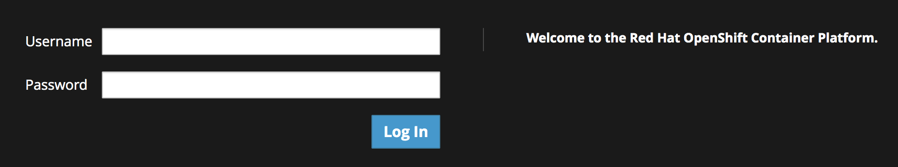

您可以使用命令行或OpenShift web控制台来处理模板。在本次研讨会中，我们将使用命令行来部署模板。

如果您仍然希望使用web控制台，请单击workshop指示板中的console选项卡。您将看到OpenShift登录屏幕。

对于凭据，输入:

* 用户名:``admin``{{copy}}
* 密码:``admin``{{copy}}

登录之后，您就可以与集群交互，并检查在研讨会中发生了什么。