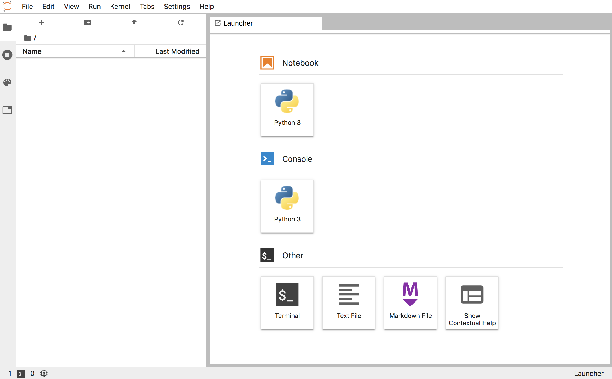

要了解我们将在本次研讨会中使用的``jupyterhub-workspace``模板的详细信息，以及使用模板时可以提供哪些参数，可以执行以下命令:

``oc describe template jupyterhub-workspace``{{execute}}

模板参数的作用是:

* ``SPAWNER_NAMESPACE`` - JupyterHub实例被部署到其中的项目的名称。
* ``CLUSTER_SUBDOMAIN`` -通过路由公开服务时用于生成主机名的子域。
* ``APPLICATION_NAME`` -部署的名称。
* ``JUPYTERHUB_IMAGE`` -您希望使用的JupyterHub镜像流的名称和版本标记。
* ``NOTEBOOK_IMAGE`` -Jupyter笔记本镜像流的名称，以及您希望使用的版本标记。
* ``JUPYTERHUB_CONFIG`` -内容自定义``jupyterhub_config.py``文件覆盖任何JupyterHub默认值。
* ``JUPYTERHUB_ENVVARS`` -要执行的shell脚本的内容，以设置任何特殊的环境变量来定制JupyterHub部署。
* ``ADMIN_USERS`` -可选的用户列表谁应该有admin访问JupyterHub实例。
* ``REGISTERED_USERS`` -一个可选的白名单用户允许访问JupyterHub实例，如果你想控制访问。
* ``DATABASE_PASSWORD`` -密码访问数据库使用的JupyterHub。
* ``COOKIE_SECRET`` -与cookie一起使用的秘密，以编码关于JupyterHub会话的信息。
* ``JUPYTERHUB_MEMORY`` - JupyterHub部署允许使用的最大内存量。
* ``DATABASE_MEMORY`` - JupyterHub数据库应用程序允许使用的最大内存量。
* ``NOTEBOOK_MEMORY`` -每个Jupyter笔记本部署允许使用的最大内存量。
* ``NOTEBOOK_INTERFACE`` -为Jupyter笔记本显示的web界面风格。
* ``OPENSHIFT_PROJECT`` -一个可选OpenShift项目的名称模板，它应该被自动创建并/或为用户创建默认项目。例如``{username}-workspace``。
* ``VOLUME_SIZE`` -用户工作区存储的可选持久卷的大小。
* ``IDLE_TIMEOUT`` -可选时间，以秒为单位，闲置的Jupyter笔记本会话应该被关闭。
* ``OAUTH_CLIENT_SECRET`` -用于与OpenShift OAuth客户端通信的秘密。

``SPAWNER_NAMESPACE``和``CLUSTER_SUBDOMAIN``模板参数是必需的，因为它们在实例化时不能由模板计算。

所有其他字段都可以保留默认值，但是我们将启用一些额外的特性。

要创建JupyterHub实例，运行以下命令:

``oc process jupyterhub-workspace --param SPAWNER_NAMESPACE=`oc project --short` --param CLUSTER_SUBDOMAIN="[[HOST_SUBDOMAIN]]-80-[[KATACODA_HOST]].environments.katacoda.com" --param NOTEBOOK_INTERFACE=lab --param OPENSHIFT_PROJECT='{username}-workspace' --param VOLUME_SIZE=1Gi --param IDLE_TIMEOUT=3600 | oc apply -f -``{{execute}}

注意，要使用``jupyterhub-workspace``模板部署JupyterHub，您必须是集群管理员。在本研讨会中，您已经作为集群管理员登录到命令行。

这是必要的，因为需要创建类型为``oauthclient``的资源，通常只有集群管理员具有require角色来创建它。

要监控部署，执行以下命令:

``oc rollout status dc/jupyterhub``{{execute}}

部署完成后，请点击网址:

<https://jupyterhub-myproject.[[HOST_SUBDOMAIN]]-80-[[KATACODA_HOST]].environments.katacoda.com> 

由于使用了安全的HTTP连接，但环境在某些情况下可能使用自签名的SSL证书，因此您需要接受证书才能继续进行。

在这个JupyterHub部署中，用户身份验证由OpenShift集群处理。当出现OpenShift登录页面时，输入用户名``user1``{{copy}}，密码``user1``{{copy}}。

当用户``user1``启动一个单独的jupiter笔记本实例时，您将看到一个进度屏幕。一旦实例启动，您就可以访问JupyterLab web界面。

此时，您可以创建新的笔记本或上传现有的笔记本。如果您需要安装额外的Python包，在使用这种类型的部署时，您需要从jupiter notebook web界面启动一个终端，并手动安装包。

在这个配置中，因为我们指定了``VOLUME_SIZE``，所以您所做的任何更改都是持久的。如果重新启动notebook实例，就不会丢失任何工作。

由于JupyterHub用于按需处理JupyterHub笔记本实例的生成，因此将允许访问相同URL的单独用户访问他们自己的笔记本会话，以及他们自己的持久存储。