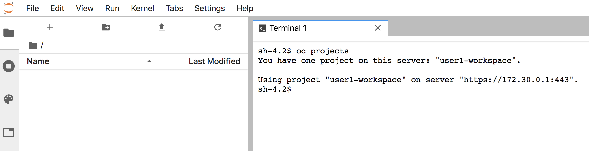

对于每个用户会话，在运行JupyterHub的同一个项目中创建一个单独的pod。Jupyter笔记本应用程序就是在这个pod中运行的。您可以通过运行以下命令来查看活动用户会话的pod列表:

``oc get pod -l component=singleuser-server``{{execute}}

每个用户允许为其jupiter notebook实例使用多少内存是由``NOTEBOOK_MEMORY``模板参数定义的。

因为已经指定了``VOLUME_SIZE``模板参数，所以将为每个用户分配他们自己的持久卷。他们第一次启动一个Jupyter笔记本，文件从Jupyter笔记本的镜像将复制到持久卷的镜像。随后对文件所做的任何更改都将被写回持久卷。如果停止了jupiter notebook实例，然后重新启动，则更改将被保留。

运行以下命令，可以看到每个用户会话声明的持久卷列表:

``oc get pvc -l component=singleuser-storage``{{execute}}

如果用户删除了他们所有的文件，或者他们想要恢复到原来的Jupyter笔记本镜像文件，他们应该通过运行以下命令创建文件``/opt/app-root/.delete-volume``:

``touch /opt/app-root/.delete-volume``

这可以通过从jupiter notebook web界面创建的终端完成。创建文件后，可以访问JupyterHub控制面板，停止服务器实例，并重新启动它。当它再次启动时，上面的文件将触发删除持久卷的内容，它将恢复到jupiter笔记本镜像中的原始内容。

如果由于某种原因更改持久卷防止Jupyter笔记本不能创建实例启动和文件,将有必要阻止Jupyter笔记本实例作为JupyterHub admin JupyterHub管理控制面板,和删除持久卷使用``oc delete pvc``命令。

当为用户的jupiter notebook实例创建pod时，将从该pod向OpenShift集群授予访问权限，访问权限由登录时的用户管理。

用户不会有任何访问pod运行的项目的权限，除非他们通常可以访问该项目。

在这个部署示例中，因为``OPENSHIFT_PROJECT``模板参数定义为``{username}-workspace``，所以将使用该名称自动创建项目，其中``{username}``将被用户自己的名称替换。在这种情况下是``user1-workspace``。你可以通过运行来检查是否正确:

``oc get project/user1-workspace``{{execute}}

这依赖于用户有能力创建新项目。他们可以部署到项目中的工作负载将取决于将为用户应用到项目中的全局资源配额和限制。

如果用户无法正常创建业务群组，可以通过集群管理员预创建所需的业务群组，设置每个业务群组的资源配额，限制范围，并根据需要授予该用户(或用户组)对业务群组的访问权限。在这种情况下，由于项目将不需要被创建，它将被作为用户的活动项目。

用户可以使用在他们的笔记本上运行的代码，使用集群REST API将工作负载部署到项目中。jupiter notebook image还提供了``oc``和``kustomize``命令行工具，它们可以从jupiter notebook界面创建的终端使用。

要测试对集群的访问，请从jupiter notebook web界面创建一个终端实例。在运行在Jupyter笔记本上的终端的登录提示符下，运行:

``oc projects``{{copy}}

您将看到可以访问哪些项目。

在创建了JupyterHub环境并使用了包含一组jupiter notebook文件的定制jupiter notebook镜像的地方，还可以包含OpenShift模板或``kustomize``的一组资源，然后可以使用该资源部署jupiter notebook所需的任何工作负载。例如，您可以从jupiter笔记本终端界面在项目中部署一个Dask或Spark集群。

如果您需要知道任何关联项目的名称，您可以从``PROJECT_NAMESPACE``环境变量计算出名称。这将在Jupyter笔记本电脑和终端。
