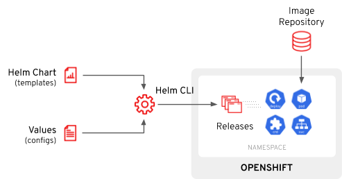
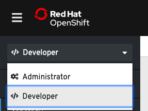
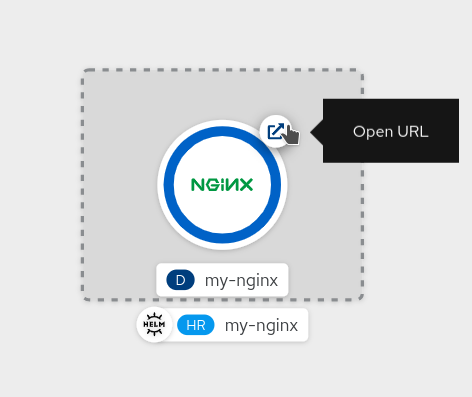
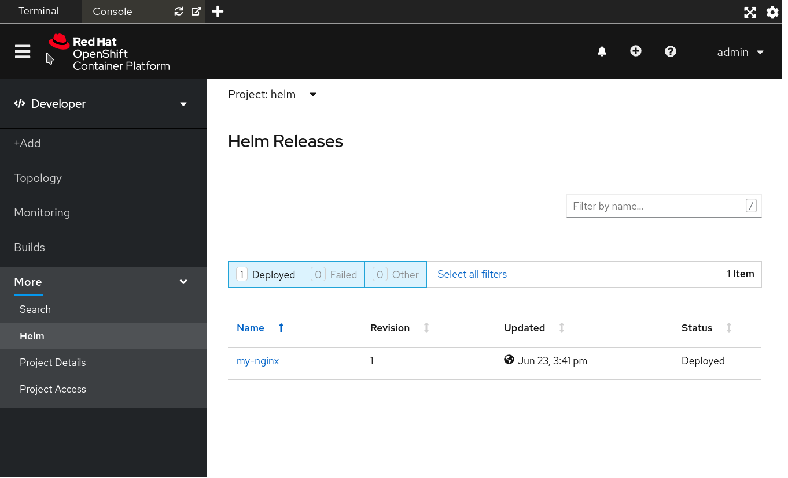
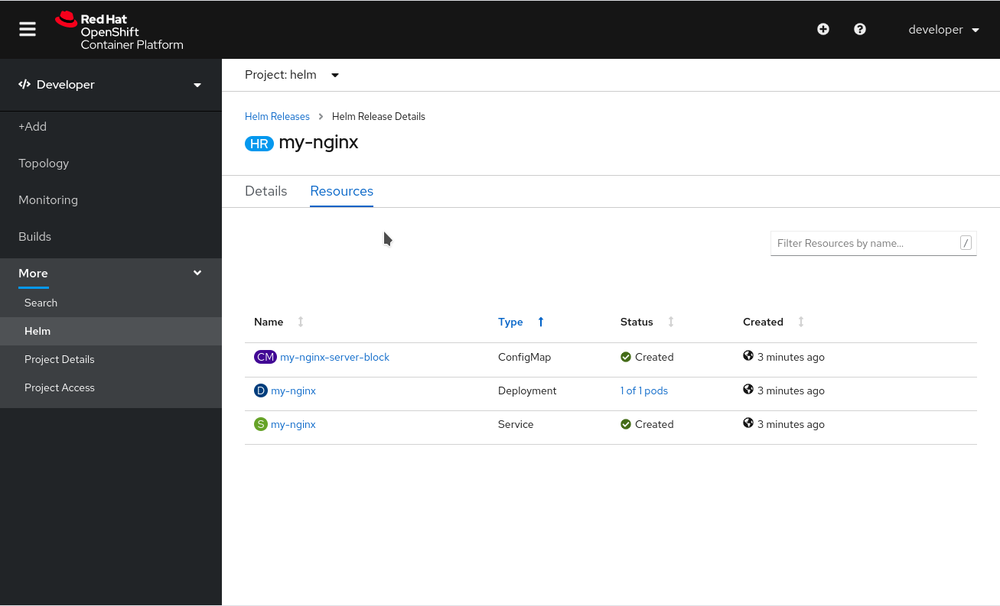

在本章结束时，你将能够:

* 使用``helm`` CLI
* 安装``helm repository``
* 搜索，安装和卸载``Helm Charts``
* 检查``OpenShift Console``的Helm图表

## Helm命令行界面(CLI)

在这个场景中，你会发现Helm CLI已经为你安装，它也可以从OpenShift控制台，右上角，点击 ? -> 命令行工具。

CLI是任何与Helm 3子系统交互的入口点。除此之外，OpenShift开发者目录是所有开发者内容的中心枢纽，除了支持Operator服务、模板等，还支持Helm图表。

当用户指示Helm CLI安装Helm Chart时，将从存储库中获取有关Helm Chart的信息，在客户机上呈现，然后应用到Kubernetes，同时在名称空间(称为发布)中创建该安装的记录。

## 登录集群

从终端运行登录到OpenShift集群:

``oc login -u developer -p developer``{{execute}}

这将使用凭据登录您:

* 用户名:``developer``{{copy}}
* 密码:``developer``{{copy}}

使用相同的凭据登录到Web控制台。

创建一个新的OpenShift项目，为我们的Helm图表提供一个命名空间。

``oc new-project helm``{{execute}}

## 练习:探索CLI

让我们开始使用``helm``获取CLI版本:

``helm version``{{execute}}

这应该可以证实我们正在使用 **Helm 3**。

正如前面的步骤中所讨论的，Helm图表可以通过存储库获得，用户可以预安装或安装这些图表。

您可以通过[Helm Hub](https://hub.helm.sh/) 搜索任何公共存储库中可用的Helm图表。

例如，搜索[NGINX](https://nginx.com) 的Helm图表:

``helm search hub nginx``{{execute}}

这将给出一个来自多个存储库的可用图表列表。如果我们想安装它，我们需要配置这样的存储库。

默认情况下，可用存储库的列表为空。您可以使用CLI添加一个新的。对于NGINX，添加Bitnami存储库:

``helm repo add bitnami https://charts.bitnami.com/bitnami``{{execute}}

一旦添加，验证它是否存在:

``helm repo list``{{execute}}

你也可以在repos里搜索Helm图表，比如你刚安装的那个:

``helm search repo bitnami/nginx``{{execute}}

## 部署一个Helm Chart

您可以使用``helm install``命令来部署图表并开始管理修订。

安装[NGINX Chart](https://hub.helm.sh/charts/bitnami/nginx) :

``helm install my-nginx bitnami/nginx --set service.type=ClusterIP``{{execute}}

这将安装``nginx``，对于本例，我们希望使用``ClusterIP``服务类型，因为我们希望随后通过OpenShift ``Route``公开它。

检查你的Helm发布:

``helm ls``{{execute}}

确认所有Pod处于运行状态并准备好:

``oc get pods``{{execute}}

现在通过OpenShift ``Route``公开``my-nginx``服务来访问它:

``oc expose svc/my-nginx``{{execute}}

验证路由是否已经创建:

``oc get routes``{{execute}}

你可以点击生成的主机来访问刚刚安装的Helm图表提供的NGINX Pod，或者你可以从OpenShift控制台来做。

## 从OpenShift控制台验证部署

要验证由Helm Chart生成的资源的创建，您可以前往OpenShift web控制台。

您可以通过单击浏览器中研讨会中心顶部的Terminal选项卡旁边的console选项卡来访问web控制台。

用户名为``developer``，密码为``developer``。

确保web控制台左上角的下拉菜单中的Developer透视图被选中，如下所示:

接下来，选择如下所示的Project下拉菜单，并选择您一直在使用的``helm``项目。

接下来，如果您没有看到下面镜像中的内容，请单击web控制台左侧的Topology选项卡。一旦进入拓扑图，就可以看到``my-nginx``应用程序的部署，点击OpenShift路由生成的URL即可访问:

你会注意到下面的HR标签和Helm图标，这意味着这个应用程序是由Helm管理的，你可以在这个应用程序的左侧菜单，Helm部分概述Helm ``Releases``:

探索所有与特定Helm``Release``相关的``Resources``，点击``my-nginx``Helm发布，然后点击``Resouces``标签:

# 卸载和清理

回到终端，点击终端选项卡。

卸载``my-nginx``发布:

``helm uninstall my-nginx``{{execute}}

删除之前创建的``route``:

``oc delete route my-nginx``{{execute}}