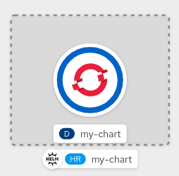

在本章结束时，你将能够:

* 创建您自己的``Helm Chart``
* 理解``Helm Templates``
* 了解Helm与``Kubernetes``的集成

在发现了``helm`` CLI来安装和管理Helm Charts之后，我们现在可以从头创建我们的第一个。在此之前，让我们回顾一下[official documentation](https://helm.sh/docs/topics/charts/) 的核心概念:

* ``Chart``是一个Helm包。它包含在Kubernetes集群中运行应用程序、工具或服务所需的所有资源定义。
* ``Repository``是可以收集和分享图表的地方。
* ``Release``是Kubernetes集群中运行的一个图表实例

Helm使用一种称为图表的包装格式。图表是描述相关Kubernetes资源集的文件集合，它被组织为目录中的文件集合。目录名称是图表的名称。

## 创建一个新的Helm图

使用``helm create``命令，您可以创建一个图表目录以及图表中使用的常见文件和目录。

我们的代码已经用这个命令生成了:

``helm create my-chart``

在``my-chart/``文件夹中，你会发现这些文件:

``tree my-chart``{{execute}}

* ``Chart.yaml``{{open}}: 一个YAML文件包含多个描述图表的字段吗
* ``values.yaml``{{open}}:: 是一个包含图表默认值的YAML文件，这些值可能在helm安装或升级期间被用户覆盖。
* ``templates/NOTES.txt``{{open}}: 文本显示给您的用户时，他们运行Helm安装。
* ``templates/deployment.yaml``{{open}}: 创建Kubernetes部署的基本清单
* ``templates/service.yaml``{{open}}: 为部署创建服务端点的基本清单
* ``templates/_helpers.tpl``{{open}}: 放置可以在整个图表中重用的模板助手的位置

这个命令会生成你的Helm图的骨架，默认情况下有一个NGINX镜像为例:

1. 图表描述

让我们回顾一下我们的``Chart.yaml``{{open}}。这包含了包的``version``和我们正在管理的``appVersion``，通常这可以引用到容器镜像标记。

2. 用自定义值填充图表

在我们的例子中，我们正在做一个Helm模板``templates/deployment.yaml``{{open}}，它描述了我们应用程序的Kubernetes部署，其中包含了``spec.containers.image``的结构:

``image: "{{ .Values.image.repository }}:{{ .Values.image.tag }}"``

> 注意:默认情况下，使用a3682b中的a137b作为镜像标签

在``values.yaml``{{open}}中添加``image.repository``变量来定义图表的容器镜像。点击下面的**Copy to Editor**按钮，将这段代码放在``values.yaml``{{open}}中:

<pre class="file" data-filename="values.yaml" data-target="insert" data-marker="# TODO: image repository">repository: bitnami/nginx</pre>

现在让我们定义这个容器镜像使用哪个标记。点击下面的**Copy to Editor**按钮，将这段代码放在``values.yaml``{{open}}中:

<pre class="file" data-filename="values.yaml" data-target="insert" data-marker="# TODO: image tag">tag: latest</pre>

3.安装

从本地文件夹安装我们的定制Helm图表。

``helm install my-chart ./my-chart``{{execute}}

这将像上一章一样安装NGINX，我们也可以像上一章一样从终端或OpenShift控制台安装NGINX:

``oc get pods``{{execute}}

审查安装修订:

``helm ls``{{execute}}

在下一章中，我们将添加一个OpenShift路径作为Helm模板，就像``Service``一样，将在新版本中发布。
