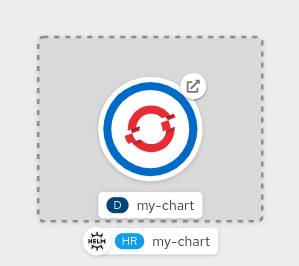
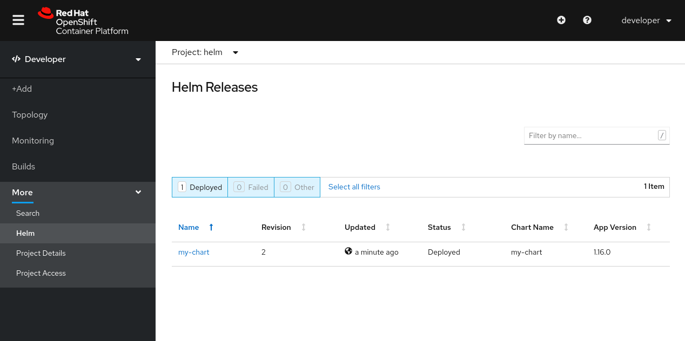

在本章结束时，你将能够:

* 为你的Helm图表管理多个``Helm Revisions``
* ``Upgrade``修订新变化
* 用``Rollback``版本恢复更改

## 升级版本

当我们在OpenShift上安装Helm Chart时，我们会在集群中发布一个版本，我们可以在升级和回滚方面进行控制。

要更改任何已经发布的图表中的内容，我们可以使用``helm upgrade``命令，并从我们的图表中添加新的参数或代码。

## 添加OpenShift路由作为模板

在``templates``目录下为OpenShift路由创建一个新模板，单击``templates/routes.yaml``{{open}}创建一个模板。单击下面的复制到编辑器按钮，将这段代码放在``templates/routes.yaml``{{open}}中

<pre class="file" data-filename="templates/routes.yaml" data-target="replace">
apiVersion: route.openshift.io/v1
kind: Route
metadata:
  name: {{ include "my-chart.fullname" . }}
  labels:
    {{- include "my-chart.labels" . | nindent 4 }}
spec:
  port:
    targetPort: http
  to:
    kind: Service
    name: {{ include "my-chart.fullname" . }}
    weight: 100
  wildcardPolicy: None
</pre>

运行``helm upgrade``来发布包含``my-charm``路由的新版本:

``helm upgrade my-chart ./my-chart``{{execute}}

从终端验证新的``Route``:

``oc get routes``{{execute}}

验证新``Revision``:

``helm ls``{{execute}}

从控制台验证新的``Route``和新的``Revision``:

## 升级和回滚

让我们再次更新我们现有的版本重写了``values.yaml``中的值，将``image.pullPolicy``的默认值``IfNotPresent``更改为``Always``，使用与我们之前使用选项``--set``更改``service.type``相同的方法:

``helm upgrade my-chart ./my-chart --set image.pullPolicy=Always``{{execute}}

让我们来验证一下我们的改变是否反映到了结果``Deployment``中:

``oc get deployment my-chart -o yaml | grep imagePullPolicy``{{execute}}

得到当前``Revision``:

``helm ls``{{execute}}

现在我们的新版本已经发布并验证了，如果需要，我们可以决定回滚到以前的版本，这是可以通过``helm rollback``命令实现的。

也可以用``--dry-run``选项进行回滚:

``helm rollback my-chart 2 --dry-run``{{execute}}

回滚到开始修订:

``helm rollback my-chart 2``{{execute}}

检查舱:

``oc get pods``{{execute}}

验证``imagePullPolicy``回滚到``Revision`` 2，包含``IfNotPresent``策略:

``oc get deployment my-chart -o yaml | grep imagePullPolicy``{{execute}}

## 卸载

卸载将清理一切现在，没有进一步的需要手动删除的``Route``像在第一章，因为Helm图表现在管理的资源:

``helm uninstall my-chart``{{execute}}