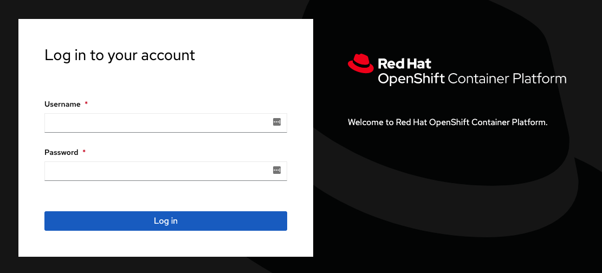
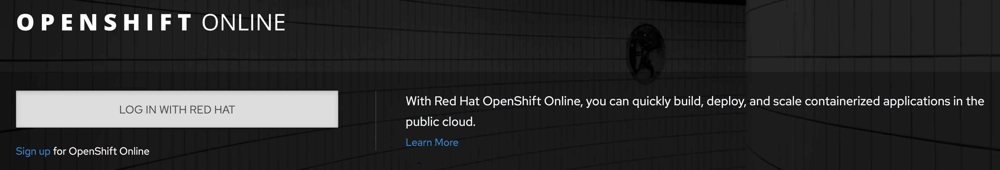
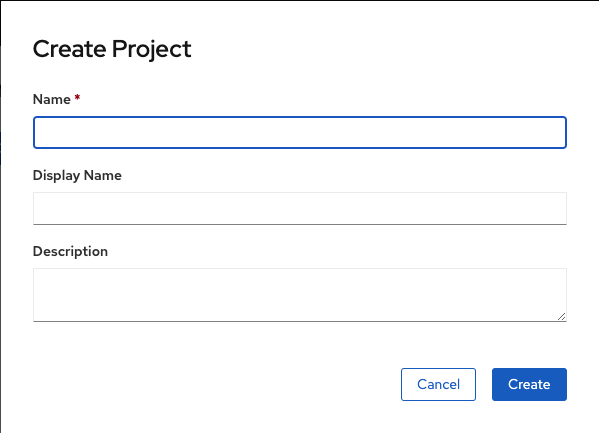
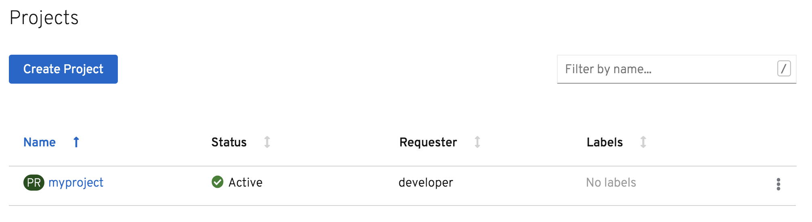

访问OpenShift并与之交互的最简单方法是通过web控制台。web控制台的URL将由OpenShift集群在设置时指定的公共URL指定。一旦访问了web控制台，您随后的登录方式将取决于配置的标识提供者。

在本课程中，web控制台的公共URL为:

``https://console-openshift-console-[[HOST_SUBDOMAIN]]-443-[[KATACODA_HOST]].environments.katacoda.com``{{copy}}

要在查看这些指令的同时查看web控制台，您还可以在嵌入的 _Terminal_ 选项卡右边选择 _Console_ 选项卡。

在OpenShift集群管理用户身份验证的情况下，web控制台登录页面将提示你输入 _Username_ 和 _Password_ 。

在使用一个外部身份验证服务作为身份提供者的情况下，首先需要登录到外部服务。例如, 如果你正在访问 [OpenShift Online](https://www.openshift.com/get-started/) 您会看到:

For the OpenShift cluster used in this course, as the OpenShift cluster is managing user authentication, you will be presented with a login page that prompts you for your user account credentials. You can login using the credentials:

* **Username:** ``developer``{{copy}}
* **Password:** ``developer``{{copy}}

As this is the first time you have logged in as this user in this OpenShift cluster, you will be presented with a "Welcome to OpenShift" message and the option of creating a new project.

Create a new project by selecting _Create Project_. Call the project ``myproject``{{copy}}.

Upon creating a project you will be left on the overview page for the new project.

If you want to get to a list of all the projects you have available, you can select "Home->Projects" from the left hand side menu. If you do not see the menu, you can click on the hamburger menu item button in the top level corner of the web console.

