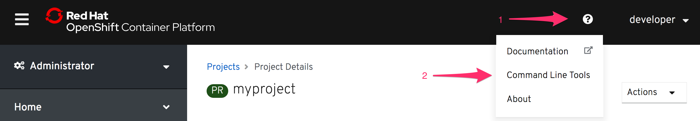
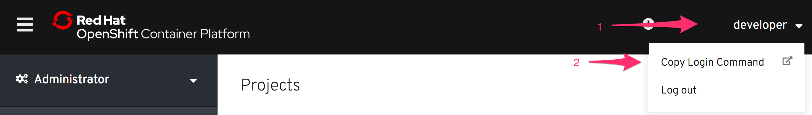

OpenShift web控制台提供了一种方便的方法，可以快速地与使用OpenShift部署的应用程序进行交互并查看其状态。并不是您想要做的所有事情都可以通过web控制台完成。因此，你还需要熟悉使用OpenShift命令行工具 ``oc``。

在这个课程中，嵌入式 _终端_ 给你提供了已经安装好的 ``oc``，所以你不需要下载和安装 ``oc`` 客户端。

如果您使用的是不同的OpenShift集群，并且还没有 ``oc`` 命令行工具，您可以通过web控制台的 _命令行工具_ 菜单选项中的链接来下载它。



当您在没有项目的情况下首次访问集群时，初始的欢迎页面上还显示了关于从哪里获得命令行工具的详细信息的链接。

找到下载列表后，你需要下载特定平台的存档文件，解压缩 ``oc`` 二进制文件并安装它。

要登录到本课程使用的OpenShift群集，请在终端运行:

``oc login``{{execute}}

这将提示您输入 _username_ 和 _password_ 。使用以下凭证:

* **Username:** ``developer``{{copy}}
* **Password:** ``developer``{{copy}}

您应该看到类似的输出:

```
Authentication required for https://openshift:6443 (openshift)
Username: developer
Password:
Login successful.

You have one project on this server: "myproject"

Using project "myproject".
```

对于您自己的集群，您需要知道登录到集群的URL，并将其作为参数传递给 ``oc login`` 。

一旦登录，您可以验证您登录的是什么用户, 通过运行:

``oc whoami``{{execute}}

您可以验证您登录到了哪个服务器, 通过运行:

``oc whoami --show-server``{{execute}}

你可以列出你目前可以访问的所有项目，通过运行:

``oc get projects``{{execute}}

对于使用一个外部身份验证服务作为身份提供者的情况，所需的步骤略有不同。

如果你在命令行上使用 ``oc login`` 登入，你会看到一个类似的错误信息:

```
Login failed (401 Unauthorized)
You must obtain an API token by visiting
  https://api.starter-us-east-1.openshift.com/oauth/token/request
```

您将访问给定的链接，如果需要的话，首先通过单独的身份验证服务登录。然后，您将被重定向到一个页面，该页面将提供要使用的登录命令的详细信息。这将包括一个访问令牌，用于对会话进行身份验证。

即使在用户身份验证由OpenShift集群管理并且用户凭证已经接受的情况下，您也可以选择使用访问令牌。您可以通过在集群访问终端的URL上手动输入 ``/oauth/token/request`` 路径来检索要运行的命令。

如果您已经登录到web控制台，您还可以通过访问你的登录名下面的 _复制登录命令_ 菜单选项来检索登录命令和访问令牌的详细信息。

 

无论您通过哪种机制从命令行使用 ``oc login` 登录，登录都会定期过期，您需要再次登录。有效期通常为24小时。
