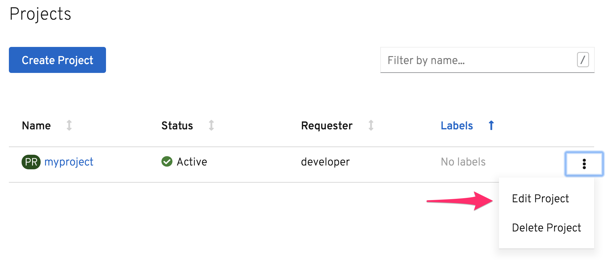
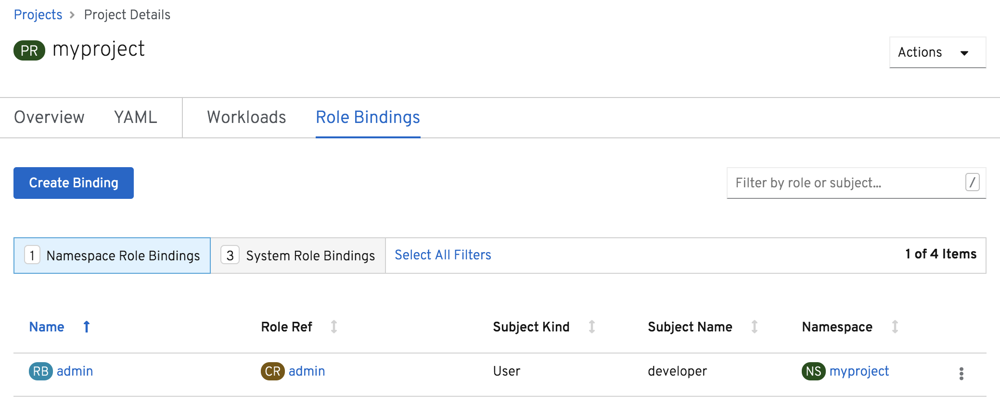
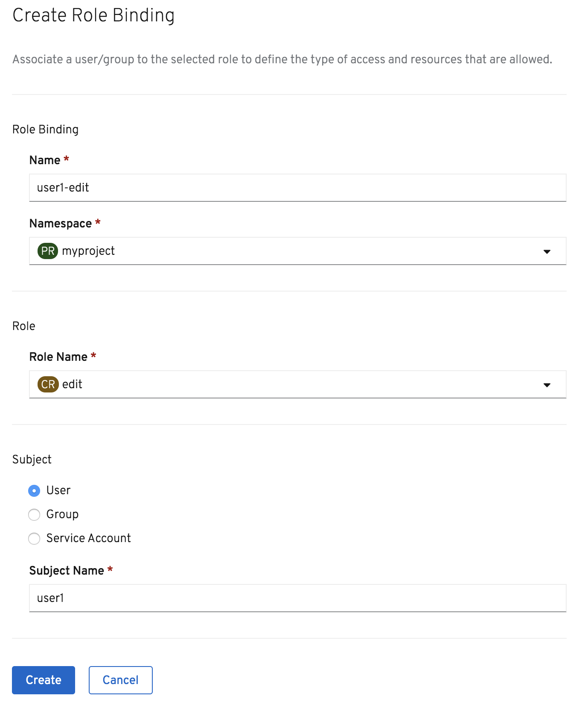

独自工作可能会很有趣，但随着你的应用程序的发展，你可能希望得到其他人的帮助。这对于OpenShift来说没有问题，因为它是构建为多租户的。这意味着它可以支持许多不同的用户，每个用户都在自己的应用程序上工作。为了支持同一项目上的协作，您还可以授予其他用户对您的任何项目的访问权。根据用户需要在项目中执行的操作，可以在不同的级别授予访问权。

为了测试用户之间如何协作，我们需要另一个用户。

通过运行以下命令以用户 ``user1`` 从命令行登录:

``oc login --username user1 --password user1``{{execute}}

这是这个用户第一次登录，所以如果你运行:

``oc get projects``{{execute}}

您应该会看到，用户没有访问任何项目的权限。

要授予此用户对项目的访问权，请在web控制台中找到项目列表，并在项目名称右侧的下拉菜单中选择 _编辑项目_ 。

当项目详细信息显示出来时，选择 _角色绑定_ 选项卡。

此时，您将看到只有 ``developer` 用户是项目的成员，该用户具有 `admin` 访问权限。

单击 _创建绑定_ 授予一个额外用户对项目的访问权。

用于角色绑定使用的名称 ``user1-edit``{{copy}} 。

确保选择了 ``myproject`` 名称空间，并且角色名为 ``edit``。

最后输入 ``user1``{{copy}} 作为主题名称。

单击 _创建_ 。

用户 ``user1`` 现在是项目的成员了。回到 _Terminal_ ，再次运行命令:

``oc get projects``{{execute}}

这就说明 ``user1`` 现在可以访问 ``developer`` 用户创建的项目。

在本例中，您在项目中为 ``user1`` 提供了角色类型 ``edit``。这允许用户执行项目中的大多数任务，除了与项目管理相关的任务之外。因此，用户不能更改项目成员关系或删除项目。

您可能会分配给一个协作者的替代角色是 ``view``，这意味着他们可以查看项目中的所有内容，但不能更改任何内容; 或者 ``admin``，这赋予他们作为项目所有者的同等权利，包括编辑项目成员关系或删除项目。

对项目成员关系的更改也可以通过命令行使用 ``oc`` 来完成。

由于 ``user1`` 此时还没有项目，通过运行以下命令创建一个:

``oc new-project mysecrets``{{execute}}

然后为 ``developer`` 添加查看这个项目能力，通过运行:

``oc adm policy add-role-to-user view developer -n mysecrets``{{execute}}

返回到web控制台的主页，项目列表为 ``developer`` 显示出来，你应该看到 ``mysecrets`` 已经列出。
