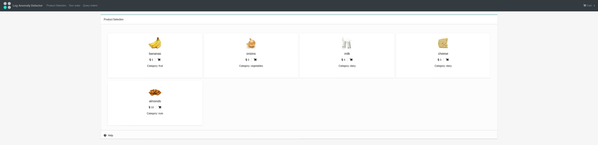
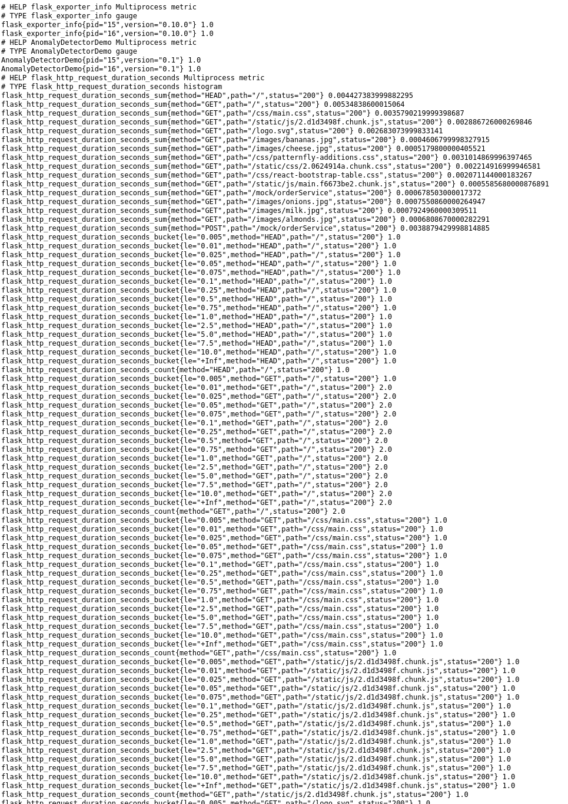

## 使用演示应用程序

演示应用程序是一个模拟的电子商务食品商店应用程序，该应用程序还公开了它的一些指标(食品商店应用程序可能要花费额外的一分钟来初始化)。

### 产生一些指标

食品店的url是:http://metrics-demo-app-metrics-demo。[[HOST_SUBDOMAIN]] -80 [[KATACODA_HOST]] .environments.katacoda.com/

* 一旦你能够访问食品商店应用程序，就可以使用它，
尽量买你喜欢的产品(这里的一切都是免费的。
* 当你在食品商店中玩游戏时，你让服务器提供一些请求(GET/POST/..)， 
这些请求的一些度量被生成并公开，供Prometheus收集。

### 暴露指标

公开的指标可以在这里找到:http://metrics-demo-app-metrics-demo。[[HOST_SUBDOMAIN]] -80 [[KATACODA_HOST]] .environments.katacoda.com/metrics

* 这是普罗米修斯定期收集数据并将其存储在持久存储设备(如硬盘驱动器)上的终结点[OpenShift PersistentVolumes](https://docs.openshift.com/container-platform/4.2/storage/understanding-persistent-storage.html#persistent-storage-overview_understanding-persistent-storage))。

* 如果您在您的环境中没有看到类似的指标(上图)，请尝试使用电子商务应用程序下订单，以生成一些指标。