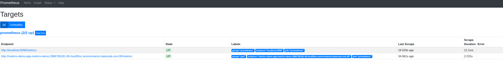

### 名称空间用于监控

我们在OpenShift上创建了一个名为`pad-monitoring`的[名称空间](https://docs.openshift.com/container-platform/4.2/applications/projects/working-with-projects.html) ，我们将在这里部署所有监控应用程序(Prometheus和Grafana)。

* 为了确保我们正在使用命名空间，运行以下命令: 
`oc project pad-monitoring`{{execute}}

* 您也可以转到OpenShift控制台并登录到那里的名称空间。

* 访问OpenShift控制台的凭证是:

  * **用户名:**`developer`{{copy}}
  * **密码:**`developer`{{copy}}

### 为我们的应用程序配置Prometheus

在OpenShift中，我们使用ConfigMaps来管理应用程序的配置([更多信息](https://docs.openshift.com/container-platform/3.11/dev_guide/configmaps.html#overview) )。

* 我们将使用下面的ConfigMap来设置Prometheus实例。

<pre class="file" data-filename="~/prometheus-configmap.yaml" data-target="replace">
apiVersion: template.openshift.io/v1          # Click on 'Copy to Editor' --->
kind: Template
objects:
  - apiVersion: v1          
    kind: ConfigMap
    metadata:
      name: prometheus-demo
      namespace: pad-monitoring
    data:     
      prometheus.yml: |     # Prometheus configuration starts below
        global:                   
          external_labels:
            monitor: prometheus
        scrape_configs:
          - job_name: 'prometheus'

            static_configs:
              - targets: ['localhost:9090'] # Configure Prometheus to scrape itself
                labels:
                  group: 'prometheus'
</pre>

* 单击上面的yaml块`Copy to Editor`，将其复制到编辑器。
这将用上面的yaml文本块替换编辑器中的所有文本

* 现在，我们需要为Prometheus部署编辑ConfigMap，以便Prometheus知道如何获取我们的演示应用程序的度量。
为了做到这一点，我们需要添加以下部分:

<pre class="file" data-filename="~/prometheus-configmap.yaml">
              - targets: ['metrics-demo-app-metrics-demo.[[HOST_SUBDOMAIN]]-80-[[KATACODA_HOST]].environments.katacoda.com'] # Click on 'Copy to Editor'->
                labels:
                  group: 'pad'
</pre>

在上面的yaml块中，我们为我们的普罗米修斯定义了一个新的目标列表，以便从中收集指标。

此目标列表具有演示应用程序的主机名，即`metrics-demo-app-metrics-demo.[[HOST_SUBDOMAIN]]-80-[[KATACODA_HOST]].environments.katacoda.com`

默认情况下，Prometheus从`/metrics` http端点收集指标。(更多关于普罗米修斯配置的信息)

在上面，您可以看到我们添加了一个标签`group: 'pad'`  
所以我们演示应用程序的所有度量都可以
使用一个单一的PromQL查询进行查询，即`{group="pad"}`{{copy}}

ConfigMap文件应该存储在一个名为`prometheus-configmap.yaml`{{open}}，  的文件中
在下一步中，我们将使用它来更新Prometheus实例。

### 用新的配置部署Prometheus

* 一旦我们用新目标更新了配置，我们就可以继续在命名空间中更新这个ConfigMap: 
`oc process -f ~/prometheus-configmap.yaml | oc apply -f -`{{execute}}

* 使用以下命令更新Prometheus部署: 
`oc rollout latest dc/prometheus-demo -n pad-monitoring`{{execute}}

在此之后，Prometheus服务器可能需要几分钟时间准备好接收请求。

Prometheus控制台应该可以[在这里](http://prometheus-demo-route-pad-monitoring.[[HOST_SUBDOMAIN]]-80-[[KATACODA_HOST]].environments.katacoda.com) 找到

您还可以使用[OpenShift仪表板](https://console-openshift-console-[[HOST_SUBDOMAIN]]-443-[[KATACODA_HOST]].environments.katacoda.com/k8s/ns/pad-monitoring/deploymentconfigs/prometheus-demo) 来检查Prometheus的部署。

* 访问OpenShift控制台的凭证是:
  * **用户名:**`developer`{{copy}}
  * **密码:**`developer`{{copy}}

### 检查配置是否成功更新

一旦Prometheus服务器准备好接受请求， 

* 访问普罗米修斯的目标页面，[在这里](http://prometheus-demo-route-pad-monitoring.[[HOST_SUBDOMAIN]]-80-[[KATACODA_HOST]].environments.katacoda.com/targets)。 
targets页面应该显示Prometheus已配置为从中收集指标的目标列表。

它应该看起来像这样:

* 如果您无法在目标列表中找到演示应用程序， 
尝试修复ConfigMap文件中的Prometheus配置`prometheus-configmap.yaml`{{open}}并重复前面的步骤。

### 检查应用程序指标

* 一旦部署了Prometheus，您可以单击这里查看演示应用程序的所有指标。
这应该查询Prometheus实例，以获得标签`group="pad"`的所有度量。

* 要了解更多关于Prometheus查询语言或PromQL的信息，您可以访问[这个页面](https://prometheus.io/docs/prometheus/latest/querying/basics/#querying-prometheus) 。

