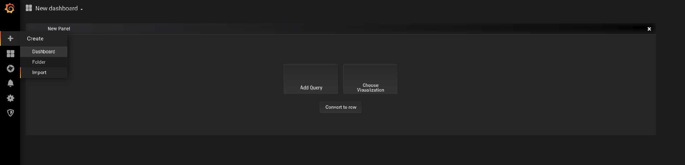
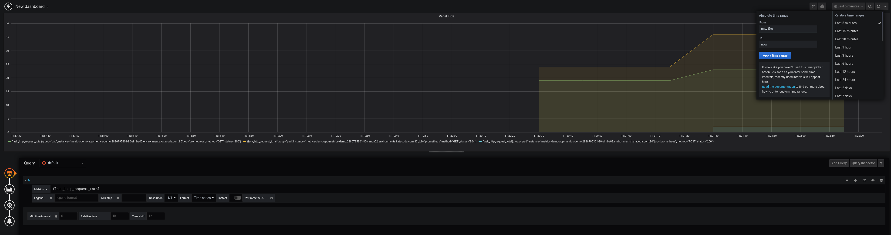
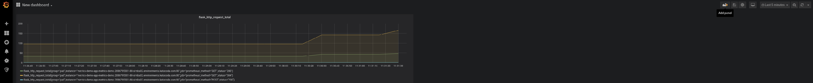
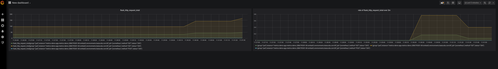

## 使用Grafana可视化指标

现在，我们将在Grafana中创建一个仪表板，并从food store应用程序中可视化一个简单的指标。

我们将可视化一个名为`flask_http_request_total`的度量，它是food store应用程序提供的请求总数。

### 创建一个仪表板

* 让我们从为可视化创建一个仪表板开始。

* 在左侧面板中，单击`Create`，然后选择`Dashboard`  

### 创建一个小组

* 您应该会看到如图所示的新面板。单击`Add Query`。

  您可以在一个仪表板中有多个面板，每个面板支持不同类型的可视化([更多信息](https://grafana.com/docs/grafana/latest/guides/getting_started/#all-users) )。 
但这里我们只看线形图因为我们处理的是时间序列数据。

* 在绘图区域下方，应该有一个用于PromQL查询的空文本框。 
输入查询`flask_http_request_total`{{copy}}

* 在右上角，您可以更改绘图持续时间。 
将持续时间改为`Last 5 minutes`。 

_你也可以选择任何其他值，只要记住
我们刚刚设置了食品店应用程序监控，因此可能只有最近的度量值可用。_ 

* 在绘图区域中看到一些线条后，单击左上角的左箭头(`<-`)。

* 现在您应该有一个带有单个面板的仪表板，让我们添加另一个带有不同度量的面板。

* 在仪表板页面的右上角，单击`Add Panel`，这次只重复前面的步骤
使用不同的查询。 
{{复制}}这应该会给你应用程序在2分钟内服务的请求率。

* 设置好第二个面板后，您的仪表盘看起来应该像这样 

如果您想查看仪表板的实时更改，请访问food store应用程序页面并进行一些购买。 
然后单击右上角的刷新按钮。

就这样, 现在您应该有自己的监视仪表板了。

**你可以用仪表盘做更多的事情，比如保存它们，导出为jsons，使用变量，等等。 
您可以在这里了解更多关于仪表板的信息**