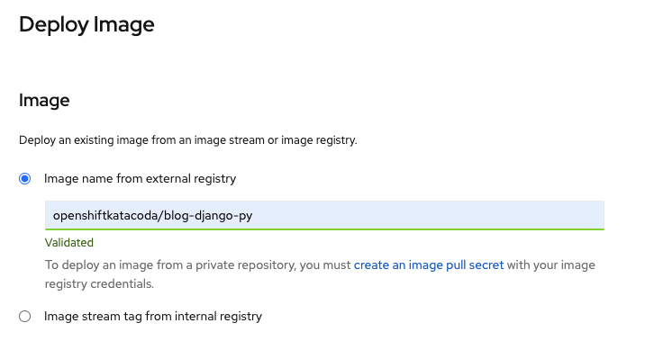
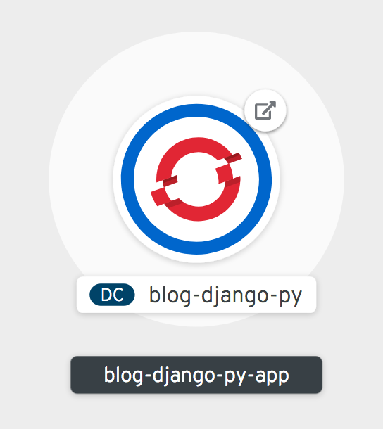

在拓扑视图上，选择容器镜像。这应该提供通过在镜像注册表上搜索镜像来部署镜像的选项。

对于本例，我们将要部署的应用程序镜像托管在Docker Hub仓库上。

在 _外部仓库_ 字段的镜像名称中输入:

`openshiftkatacoda/blog-django-py`{{copy}}

按tab键或单击文本字段外。这将触发一个查询验证镜像。

根据镜像的名称，将自动填充 _应用程序名称_ 和部署名称字段。

OpenShift中使用部署名称来标识在部署应用程序时创建的资源。这将包括同一项目中其他应用程序用于与其通信的内部 _服务_ 名，以及在通过路由向集群外部公开时作为应用程序的默认主机名的一部分使用。

_应用程序名称_ 字段用于将多个部署以相同的名称组合在一起，作为整个应用程序的一部分。

在本例中，将这两个字段保留为它们的默认值。对于您自己的应用程序，您可以考虑将这些更改为更合适的内容。

在此页的底部，您将看到选中了用于创建应用程序路由的复选框。这表示将自动为应用程序提供一个公共URL来访问它。如果您不希望部署在集群之外被访问，或者它不是一个web服务，那么您将取消选择该选项。

准备好之后，在页面底部单击 _创建_ 。这将返回到拓扑视图，但这次您将看到部署的表示，而不是部署应用程序的选项。

你可以看到环的颜色从白色，到浅蓝色，然后是蓝色。这表示应用程序的容器启动时的部署阶段。