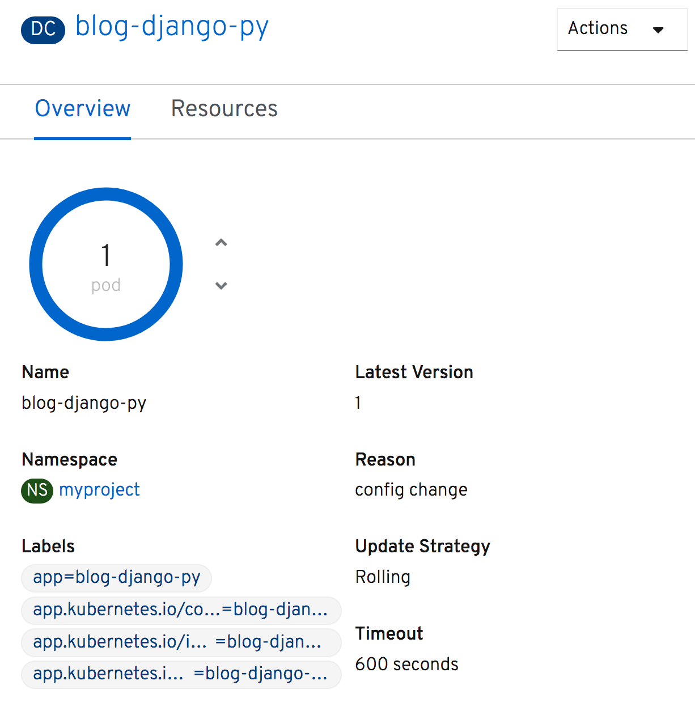
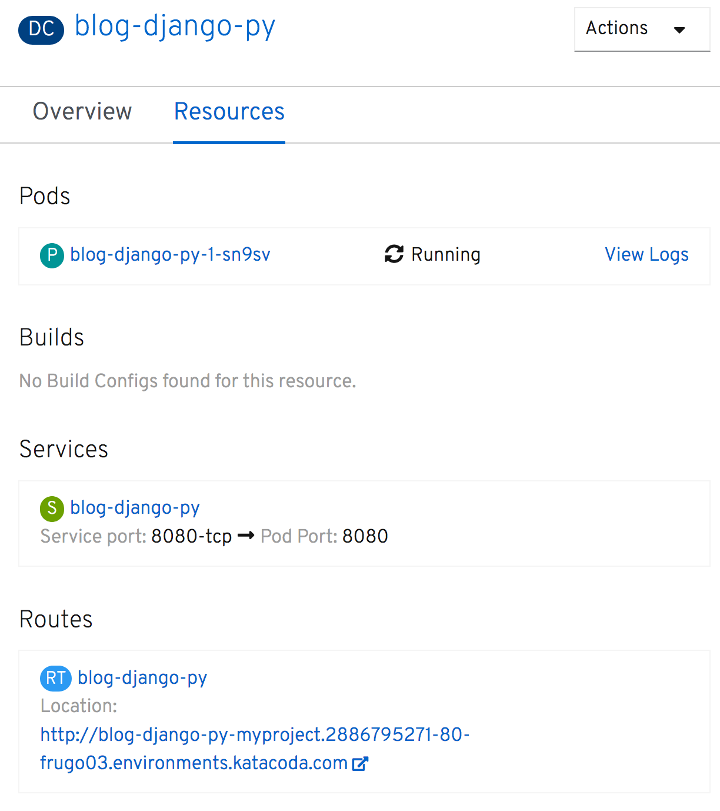
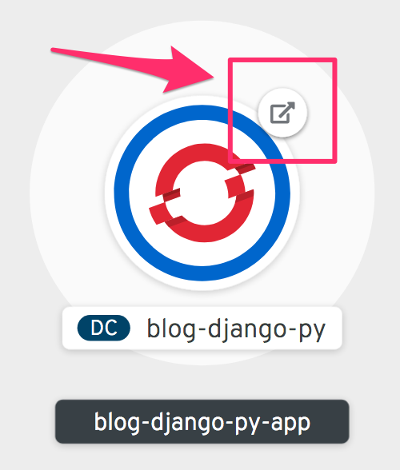

要深入了解部署的详细信息，请单击环的中间部分。这将导致一个面板从右侧滑出，提供访问 _概述_ :

以及与部署有关的_资源_ 的详细信息。

在部署 _概述_ 中，您可以通过单击圆环右侧的向上和向下箭头来调整副本或pods的数量。

访问应用程序的公共URL可以在 _资源_ 下面找到。

如果您关闭面板，您也可以通过它的公共URL访问应用程序，通过单击可视化部署上的URL快捷方式图标。

