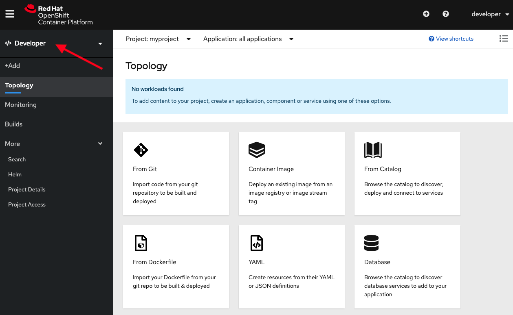

在我们开始之前，您需要登录并在OpenShift中创建一个项目
在工作。

要从_终端_ 登录到本课程使用的OpenShift群集，
运行:

`oc login -u developer -p developer`{{execute}}

这将使用凭证登录您:

* **用户名:** `developer`
* **密码:** `developer`

您应该会看到输出:

```
Login successful.

You don't have any projects. You can try to create a new project, by running

    oc new-project <projectname>
```

要创建一个名为`myproject`的新项目，运行以下命令:

`oc new-project myproject`{{execute}}

你应该看到类似的输出:

```
Now using project "myproject" on server "https://openshift:6443".

You can add applications to this project with the 'new-app' command. For example, try:

    oc new-app django-psql-example

to build a new example application in Python. Or use kubectl to deploy a simple Kubernetes application:

    kubectl create deployment hello-node --image=gcr.io/hello-minikube-zero-install/hello-node
```

切换到_控制台_ 并使用。登录到OpenShift web控制台
与上面使用的凭据相同。


这应该会让您停留在您可以访问的项目列表中。当我们只
创建了一个项目，你应该看到的是`myproject`。


单击`myproject`，然后您应该在_概述_页面为
该项目。为项目选择_开发人员_ 透视图，而不是左侧菜单中的_管理员_ 透视图。如果有必要，单击web控制台左上角的汉堡包菜单图标，以显示左边的菜单。



由于项目当前是空的，不应该找到工作负载，您将看到如何部署应用程序的各种选项。