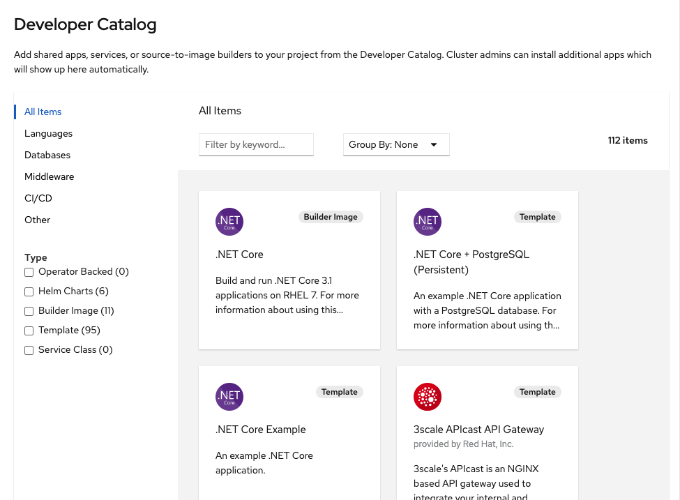
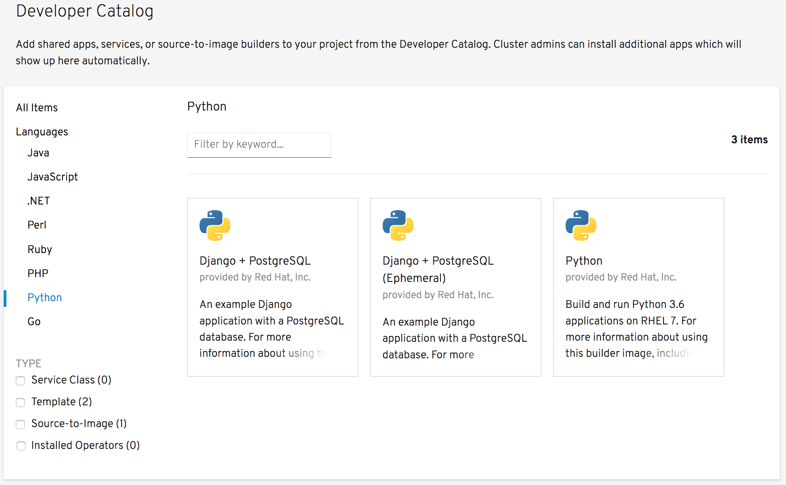
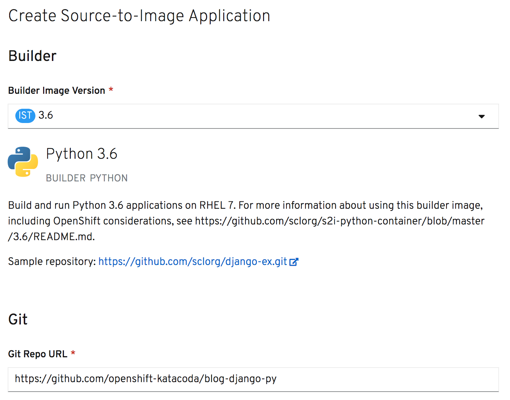
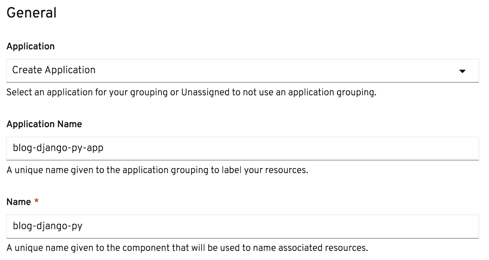
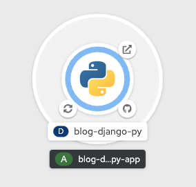
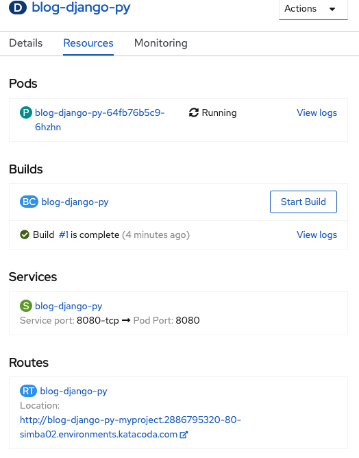

从为部署应用程序提供的选项中，选择“从Catalog”。这将使您进入_开发人员目录_。

在本课程中，你将部署一个使用Python编程语言实现的web应用程序。

如果在查看_开发人员目录_时没有显示任何项，则取消左侧_类型_筛选器中支持的选中操作符。单击左边的_语言_ ，然后选择_Python_ 。任何与Python相关的应用程序部署选项都将显示出来。

单击_Python_ tile获得通用的Python源代码到映像(S2I)构建器。这将弹出一个对话框，显示构建器映像的详细信息。在对话框中单击_创建应用程序_ 。

在_Git_ 设置下，在_Git存储库URL_ 中输入:

`https://github.com/openshift-katacoda/blog-django-py`{{copy}}

向下滚动到常规设置，然后单击_应用程序名称_ 字段。

当单击_应用程序名称_字段时，此部分中的设置应该根据Git存储库名称预填充值。保持设置的默认值不变。

准备好之后，在页面底部单击_创建_ 。这将创建资源来管理应用程序的构建和部署。然后您将被重定向到项目的拓扑概述。

拓扑概述提供了已部署应用程序的可视化表示。

可以单击环右下方显示的Git图标，将您带到托管的Git存储库，应用程序的源代码就是从该存储库构建的。

左下角显示的图标表示应用程序的构建。该图标将从显示一个小时玻璃杯(表示构建正在开始)变为一个同步图标(表示构建正在进行)，最后变成一个勾号或十字号，具体取决于构建是成功还是失败。单击此图标将带您到当前构建的详细信息。

应用程序运行后，可以单击右上角的图标，打开创建的应用程序路由的URL。

环本身将从白色(表示部署未完成)进展到浅蓝色(表示部署正在启动)，蓝色(表示应用程序正在运行)。如果应用程序停止，圆环也可以变成深蓝色。

单击ring所包围区域上的任何地方，将出现一个面板，提供应用程序资源的详细信息，并访问部署的总体概况。

