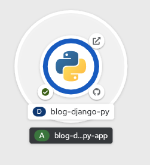

一旦完成了应用程序镜像的构建，就将部署它。

单击左边菜单栏中的_拓扑结构_ 以返回项目的Topology视图。

当您使用web控制台创建应用程序时，将自动为应用程序创建一个路由，并且它将在集群之外公开。可以用于从web浏览器访问应用程序的URL在您前面看到的应用程序的_资源_ 选项卡上可见。

在拓扑视图中，通过单击可视化应用程序环右上角的图标，可以快速访问已部署应用程序的URL。

等待戒指从浅蓝色变为蓝色，表示部署完成。现在单击图标，您应该会看到您部署的博客应用程序。

