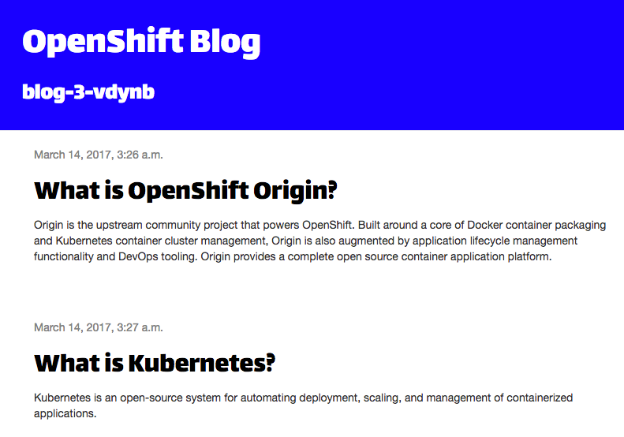

应用程序的源代码不会是静态的，因此需要一种在做出任何更改后触发新构建的方法。

使用`oc`从命令行执行以下命令:

`oc start-build blog-django-py`{{execute}}

这应该显示:

```
build.build.openshift.io/blog-django-py-2 started
```

通过在build菜单下找到应用程序的_构建_配置，选择条目右侧的kebab菜单，并单击Start build，也可以从web控制台中触发新的构建。

和以前一样，您可以在构建运行时使用`oc logs`监视日志输出。你也可以通过运行命令来监视项目中的任何构建的进度:

`oc get builds --watch`{{execute}}

随着构建的进行，这应该显示类似于:

```
NAME                TYPE      FROM          STATUS     STARTED         DURATION
blog-django-py-1    Source    Git@fcdc38c   Complete   2 minutes ago   1m2s
blog-django-py-2    Source    Git@fcdc38c   Running    3 seconds ago   3s
blog-django-py-2    Source    Git@fcdc38c   Complete   About a minute ago   1m9s
```

要退出命令，请在终端窗口中键入 _CTRL-C_ 。

要显示你可以运行的应用程序的构建配置信息:

`oc describe bc/blog-django-py`{{execute}}

这将显示输出类似于:

```
Name:           blog-django-py
Namespace:      myproject
Created:        8 minutes ago
Labels:         app=blog-django-py
Annotations:    openshift.io/generated-by=OpenShiftNewApp
Latest Version: 2

Strategy:       Source
URL:            https://github.com/openshift-katacoda/blog-django-py
From Image:     ImageStreamTag openshift/python:latest
Output to:      ImageStreamTag blog-django-py:latest

Build Run Policy:       Serial
Triggered by:           Config, ImageChange
Webhook GitHub:
        URL:    https://openshift:6443/apis/build.openshift.io/v1/namespaces/myproject/buildconfigs/blog-django-py/webhooks/<secret>/github
Webhook Generic:
        URL:            https://openshift:6443/apis/build.openshift.io/v1/namespaces/myproject/buildconfigs/blog-django-py/webhooks/<secret>/generic
        AllowEnv:       false
Builds History Limit:
        Successful:     5
        Failed:         5

Build                   Status          Duration        Creation Time
blog-django-py-2        complete        1m28s           2019-11-05 05:19:32 +0000 UTC
blog-django-py-1        complete        1m31s           2019-11-05 05:13:21 +0000 UTC

Events: <none>
```

您可以看到Git存储库的详细信息被用作任何构建的源代码。

您还将看到列出的webhook url，这些url可以配置到Git托管服务中，以便在提交更改并将更改推到Git存储库时自动触发新的构建。因为你在GitHub上使用的是你不拥有的Git存储库，所以在这个练习中不能这样做，但是如果你已经把Git存储库分叉到你自己的账户中，或者这是你自己的应用程序，它可能已经被配置好了。

开发应用程序时遵循的典型工作流是在您自己的本地机器上处理应用程序源代码。当您对更改感到满意，并且这些更改准备就绪时，提交更改并将其推送到链接到构建配置的托管Git存储库中。如果已经配置了webhook，新的构建和部署将自动触发，否则您可以手动触发新的构建。

在这种情况下，您正在快速迭代更改以测试想法，并且不想必须提交每个更改并将其推回托管的Git存储库，您可以使用所谓的二进制输入构建。

为了演示这一点，运行以下命令克隆应用程序的Git仓库:

`git clone https://github.com/openshift-katacoda/blog-django-py`{{execute}}

这将创建一个包含应用程序源代码的子目录`blog-django-py`:

```
Cloning into 'blog-django-py'...
remote: Enumerating objects: 3, done.
remote: Counting objects: 100% (3/3), done.
remote: Compressing objects: 100% (3/3), done.
remote: Total 412 (delta 0), reused 0 (delta 0), pack-reused 409
Receiving objects: 100% (412/412), 68.49 KiB | 556.00 KiB/s, done.
Resolving deltas: 100% (200/200), done.
```

切换到子目录。

`cd blog-django-py`{{execute}}

为了展示如何从应用程序源代码的本地副本触发构建，而不需要将更改提交回Git存储库，首先运行以下命令:

`echo 'BLOG_BANNER_COLOR=blue' >> .s2i/environment`{{execute}}

该命令将更新S2I使用的环境变量设置文件，以确定将哪些环境变量烘焙到创建的应用程序映像中。

通过运行命令开始一个新的构建:

`oc start-build blog-django-py --from-dir=. --wait`{{execute}}

这类似于你跑之前,除了选择`--from-dir=.`也传递给命令,显示源代码应该上传的目录在主机运行的命令,而不是被推倒的托管Git存储库。

运行该命令的输出应该以以下内容开始:

```
Uploading directory "." as binary input for the build ...
```

指示正在上载源代码。

还提供了`--wait`选项，以指示命令只应在构建完成时返回。如果将其集成到脚本中，并且需要在运行后续命令之前确保构建已经完成，则此选项可能非常有用。

在运行构建命令并部署应用程序时，切换到web控制台以监视进度。您可以通过从左侧菜单中选择build，选择`blog-django-py`的build配置，选择build选项卡，然后单击`blog-django-py-3`来找到当前_构建_ 的详细信息。

构建和部署完成后，如果再次访问web应用程序，您将看到横幅颜色已更改为蓝色。



当您将`--from-dir=.`选项与`oc start-build`一起使用时，当前工作目录中的内容将仅用于该构建。如果您希望使用本地目录中的源代码运行进一步的构建，则每次都需要提供`--from-dir=.`。

要返回到使用宿主Git存储库的源代码，可以运行:

`oc start-build blog-django-py`{{execute}}

这应该输出:

```
build.build.openshift.io/blog-django-py-4 started
```

如果由于某种原因错误地启动了一个构建，或者您意识到它无论如何都会失败，那么您可以通过运行`oc cancel-build`并提供构建的名称来取消构建。

`oc cancel-build blog-django-py-4`{{execute}}

这应该显示构建已被取消。

```
build.build.openshift.io/blog-django-py-4 marked for cancellation, waiting to be cancelled
build.build.openshift.io/blog-django-py-4 cancelled
```

您也可以通过查看所有运行的构建列表来确认这一点。

`oc get builds`{{execute}}

这应该显示输出类似于:

```
NAME               TYPE     FROM             STATUS                       STARTED          DURATION
blog-django-py-1   Source   Git@35b89e2      Complete                     15 minutes ago   1m31s
blog-django-py-2   Source   Git@35b89e2      Complete                     8 minutes ago    1m28s
blog-django-py-3   Source   Binary@35b89e2   Complete                     3 minutes ago    1m28s
blog-django-py-4   Source   Git@35b89e2      Cancelled (CancelledBuild)   31 seconds ago   23s
```

注意，从您自己机器上的本地目录使用源代码开始构建只能从命令行完成。没有办法从web控制台触发这样的构建。