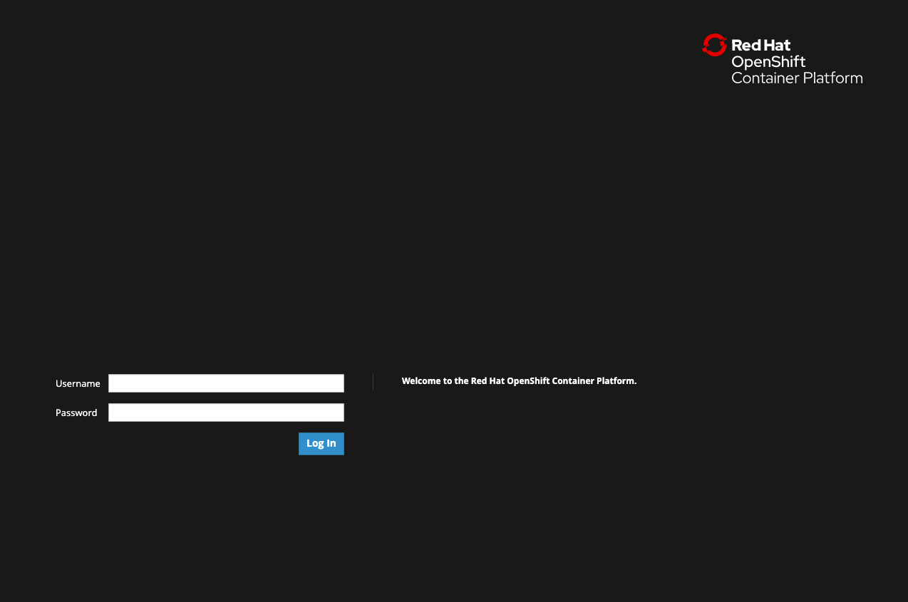
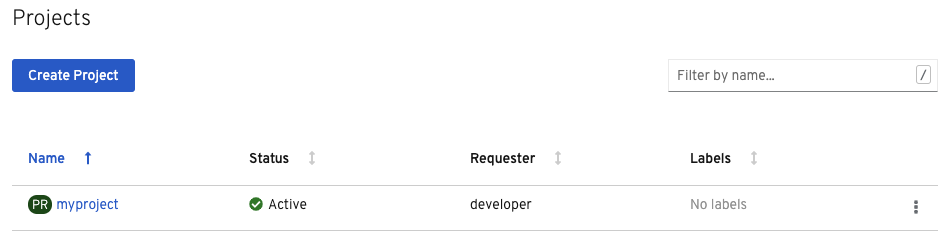
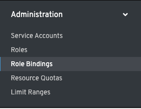
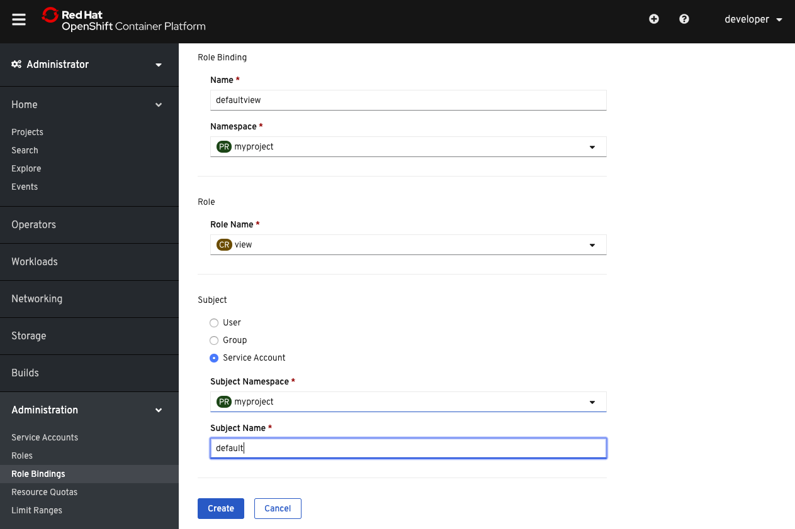

## 登录到OpenShift

在开始之前，您需要登录到OpenShift。要从 _终端_ 登录到本场景使用的OpenShift集群，
运行:

 ``odo login -u developer -p developer``{{execute}}

这将使用凭证登录您:

* **用户名:** ``developer``
* **密码:** ``developer``

您应该会看到下面的输出:

```
Connecting to the OpenShift cluster

Login successful.

You don't have any projects. You can try to create a new project, by running
  odo project create <project-name>
```

我们将通过运行 ``odo project create`` 来创建一个新项目:

 ``odo project create myproject``{{execute}}

你应该看到下面的输出确认了名为 ``myproject`` 的新OpenShift项目的创建，并且 ``odo`` 现在正在使用 ``myproject`` :

```
 ✓ New project created and now using project : myproject
```

## 创建服务帐户

应用程序的后端使用OpenShift REST API。为了让后端访问API，我们需要授予对后端正在使用的服务帐户的访问权。我们将在web控制台中执行此操作。

单击浏览器中央顶部靠近 **终端** 选项卡旁边的 **控制台** 选项卡。这将打开OpenShift web控制台。

您应该会看到一个带有 **用户名** 和 **密码** 字段的OpenShift窗口，它与下面这个类似:



对于这个场景，首先输入以下内容:

 **用户名:** ``developer``{{copy}}

 **密码:** ``developer``{{copy}}

登录到web控制台后，您将处于web控制台的 **管理员** 透视图中，这是用于处理与OpenShift集群相关的操作和管理任务的控制台视图。

首先，选择您刚刚使用 ``odo`` 创建的项目(即。 ``myproject`` )点击 **项目** 页面 ``myproject`` ，如下图所示:



通过单击项目名称，您将转到 **项目详细信息** 页面，该页面显示有关项目中正在发生的事情的信息。通过单击项目名称，您现在也在使用这个项目，通过web控制台的所有操作现在都将在这个项目中发生。

在控制台的左侧，单击 **政府** 选项卡并选择 **RoleBindings** 选项，如下所示:



在 **RoleBindings** 页面上，单击 **创建绑定** 按钮，用如下所示的信息填充向导:



请随意复制以下角色绑定名称和服务帐户主题名称的信息:

 **角色绑定名称:** ``defaultview``{{copy}}

 **主题名称:** ``default``{{copy}}

现在后端使用的服务帐户具有 **视图** 访问，因此它可以通过API检索对象。注意，您可以选择 **编辑** 访问。这将允许后端检索、修改或删除对象。如果你这么做了，你可能会破坏游戏中某些不可恢复的资源，这就是为什么我们在这个场景中选择 **视图** 访问。