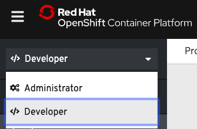
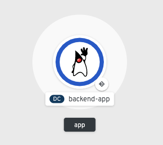

如前所述，应用程序通常由两个或多个组件组成，它们共同工作以实现整个应用程序。OpenShift帮助组织这些模块化的应用程序，其概念恰当地称为应用程序。一个OpenShift应用程序在一个逻辑管理单元中表示一个应用程序的所有组件。 ``odo`` 工具可以帮助您管理组件组，并将它们作为一个应用程序链接在一起。

在OpenShift集群上可以选择运行时、框架和其他组件来构建应用程序。此列表称为 **开发人员目录** 。

运行以下命令列出目录中支持的组件类型:

 ``odo catalog list components``{{execute}}

管理员可以配置目录，以确定目录中有哪些组件可用，因此在不同的OpenShift集群中，该列表将有所不同。对于这个场景，集群的目录列表必须包括 ``java`` 和 ``nodejs`` 。

我们的 ``wildwest`` 应用程序的后端源代码可以在命令行环境中获得。将目录更改为源目录 ``backend`` :

 ``cd ~/backend``{{execute}}

看一下 ``backend`` 目录的内容。它是一个使用Maven构建系统的常规Java Spring引导应用程序:

 ``ls``{{execute}}

用Maven构建 ``backend`` 源文件，创建jar文件:

 ``mvn package``{{execute}}

由于这是第一次运行这个构建，所以可能需要30-45秒才能完成。后续的构建将运行得更快。

构建了后端 ``.jar`` 文件后，我们可以使用 ``odo`` 来部署它，并在前面的目录中看到的Java应用程序服务器上运行它。下面的命令创建一个名为 ``backend`` 的 _组件_ 类型为 ``java`` 的组件配置:

 ``odo create java:8 backend --binary target/wildwest-1.0.jar``{{execute}}

当组件配置创建后， ``odo`` 将打印以下内容:

```
✓ Validating component [6ms]
Please use `odo push` command to create the component with source deployed
```

该组件尚未在OpenShift上部署。使用 ``odo create`` 命令，已经在 ``backend`` 组件的本地目录中创建了一个名为 ``config.yaml`` 的配置文件，该文件包含关于要部署的组件的信息。

查看 ``config.yaml`` 中 ``backend`` 组件的配置设置， ``odo`` 有一个命令来显示此信息:

 ``odo config view``{{execute}}

由于 ``backend`` 是二进制组件(如上面的 ``odo create`` 命令所指定)，因此在更改组件的源代码之后，应该将jar文件推入正在运行的容器。在 ``mvn`` 编译了一个新的 ``wildwest-1.0.jar`` 文件之后，该程序将使用 ``odo push`` 命令部署到OpenShift。我们现在就可以执行这样的push:

 ``odo push``{{execute}}

随着推送的进行， ``odo`` 将打印类似如下的输出:

```
Validation
 ✓ Checking component [13ms]

Configuration changes
 ✓ Initializing component
 ✓ Creating component [107ms]

Pushing to component backend of type binary
 ✓ Checking files for pushing [2ms]
 ✓ Waiting for component to start [59s]
 ✓ Syncing files to the component [14s]
 ✓ Building component [2s]
```

使用 ``odo push`` , OpenShift创建了一个容器来托管 ``backend`` 组件，将该容器部署到一个运行在OpenShift集群上的pod中，并启动了 ``backend`` 组件。

通过从 **管理员** 透视图切换到 **开发人员** 透视图，您可以在web控制台中查看正在启动的 ``backend`` 组件。要做到这一点，从下拉菜单中选择 **开发人员** 选项如下所示:



选择 **开发人员** 选项之后，您将进入拓扑视图，该视图显示在OpenShift项目中部署了哪些组件。 ``backend`` 组件被成功部署为运行在pod上的容器。当后端组件周围出现如下所示的深蓝色圆圈时，pod准备好了， ``backend`` 组件容器将开始在其上运行。



如果要检查 ``odo`` 中操作的状态，可以使用 ``odo log`` 命令。当 ``odo push`` 完成后，运行 ``odo log`` ，跟踪 ``backend`` 组件部署的进度:

 ``odo log -f``{{execute}}

您应该看到类似如下的输出，以确认 ``backend`` 正在 ``myproject`` 中的pod中的容器上运行:

```
2019-05-13 12:32:15.986 INFO 729 --- [      main] c.o.wildwest.WildWestApplication     : Started WildWestApplication in 6.337 seconds (JVM running for 7.779)
```

 ``backend`` jar文件现在已经推送，``backend`` 组件正在运行。