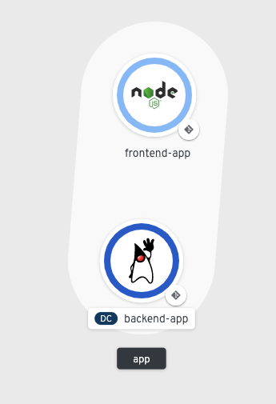
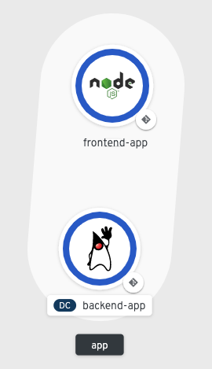
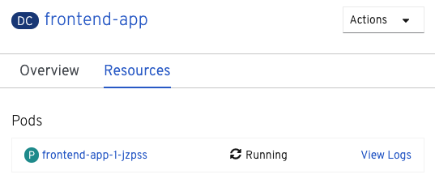

在 ``backend`` 组件运行并连接到持久存储之后，我们准备启动 ``frontend`` 组件并将其连接到 ``backend`` 。同样，该组件的源代码已经在命令行环境中可用。

将目录更改为 ``frontend`` 目录:

 ``cd ~/frontend``{{execute interrupt}}

列出该目录的内容表明 ``frontend`` 是一个Node.js应用程序。

 ``ls``{{execute}}

由于 ``frontend`` 是用解释语言编写的，所以没有与我们为 ``backend`` 组件执行的Maven构建步骤类似的构建步骤。我们可以直接从集群的目录中指定 ``nodejs`` 环境。

我们将这个Node.js组件命名为 ``frontend`` :

 ``odo create nodejs frontend``{{execute}}

 ``odo`` 将创建一个 ``config.yaml`` ，就像 ``backend`` 组件一样，你应该看到以下输出:

```
✓ Validating component [6ms]
Please use `odo push` command to create the component with source deployed
```

有了命名的组件和创建的配置文件，我们可以从当前目录下推Node.js源代码:

 ``odo push``{{execute}}

 ``odo push`` 应该产生以下输出:

```
Validation
 ✓ Checking component [23ms]

Configuration changes
 ✓ Initializing component
 ✓ Creating component [86ms]

Pushing to component frontend of type local
 ✓ Checking files for pushing [710993ns]
 ✓ Waiting for component to start [52s]
 ✓ Syncing files to the component [26s]
 ✓ Building component [8s]
 ✓ Changes successfully pushed to component
```

当我们创建 ``backend`` 组件时，我们通过终端查看日志。您还可以在web控制台中跟踪容器创建的状态。单击 **控制台** 选项卡，并确保您位于名为 ``myproject`` 的项目中。

根据您的 ``odo push`` 的距离，您可能会看到 ``frontend`` 组件的pod启动了一个浅蓝色环，如下所示。这个浅蓝色的圆环表示豆荚处于待定状态，还没有启动:



一旦荚变得可用，你会看到 ``frontend`` 组件变得可用，周围有一个深蓝色的环，就像 ``backend`` 组件一样。如下所示:



要查看 ``frontend`` 组件的日志，等待深蓝色环出现在组件周围，然后单击 ``frontend`` 组件圆。这将打开 ``frontend`` 的部署配置，并在 **豆荚** 部分下显示 **查看日志** 的选项。如下所示:



单击 **查看日志** ，您应该最终看到以下日志，确认 ``frontend`` 正在运行:

```
CONFIG ERROR: Can't find backend webservices component!
Use `odo link` to link your front-end component to a backend component.
Listening on 0.0.0.0, port 8080
Frontend available at URL_PREFIX: /
{ Error: 'Backend Component Not Configured' }
```

现在不要担心错误消息!你将在下一节中更正这个错误。

查看完日志后，单击web控制台左侧的 **拓扑结构** 选项卡，返回到 ``myproject`` 。