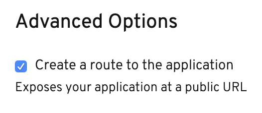

在本节中，您将部署名为 **parksmap** 的应用程序的前端组件。该web应用程序将显示一个交互式地图，用于显示来自世界各地的主要国家公园的位置。

# 练习: 部署您的第一个镜像

在OpenShift中部署应用程序的最简单方法是获取一个现有的容器镜像并运行它。我们将使用OpenShift web控制台来完成此操作，因此请确保您打开了OpenShift web控制台并激活了开发人员视角，并且您处于名为 ``myproject`` 的项目中。

OpenShift web控制台提供了将应用程序部署到项目的各种选项。对于本节，我们将使用容器图像方法。由于项目此时为空，拓扑视图应该显示以下选项: _从Git_ ，容器镜像，目录，Dockerfile,  _YAML_ 和 _数据库_ 。

选择容器镜像选项。

将来，若要返回向项目 _添加_ 内容的方式菜单，可以单击左侧导航栏中的 *+Add* 。

在Deploy镜像页面中，从外部注册表输入以下映像名称:

``docker.io/openshiftroadshow/parksmap-katacoda:1.2.0``{{copy}}

按tab键或点击文本框外确认图像:

 _应用程序名称_ 字段将使用 ``parksmap-katacoda-app`` 填充，名称字段将使用 ``parksmap-katacoda`` 填充。此名称将用于您的应用程序以及与之相关的各种组件。将此值保留为生成的值，因为后面几节中给出的步骤将使用此名称。

默认情况下，使用容器镜像方法创建部署也将为应用程序创建路由。一个路由使你的应用程序在一个公共可访问的URL上可用。

通常，你会保持这个复选框是选中的，因为为你创建路线是非常方便的。为了学习的目的，不要打勾。我们将在教程后面学习更多关于路由的知识，然后我们将自己创建路由。

现在可以部署现有的容器镜像了。单击屏幕底部的蓝色 _创建_ 按钮。这将把您带回到拓扑视图，在那里您将看到刚刚部署的应用程序的可视化表示。随着镜像部署的进展，您将看到围绕 ``parksmap-katacoda`` 的部署过程从白色到浅蓝色再到蓝色。

这是获得香草味的必经之路。在OpenShift上部署的容器镜像。这应该适用于遵循最佳实践的任何容器镜像，比如定义任何服务公开的端口，不需要作为 _根用户_ 或其他专用用户运行，以及嵌入用于运行应用程序的默认命令。