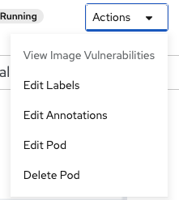

让我们将应用扩展到pods的2个实例。您可以通过在 _拓扑结构_ 视图中单击 ``parksmap-katacoda`` 应用程序的圆圈内打开侧板来完成此操作。在侧边面板中，单击详细信息选项卡，然后单击"up"旁边的箭头侧板上的 *Pod*。

要验证我们更改了副本的数量，请单击侧面板中的 _资源_ 选项卡。你应该会看到如下图所示的豆荚列表:

你可以看到我们现在有两个副本。

总的来说，这就是扩展应用程序是多么简单(在一个 *Service* 中的*Pods*)。应用程序扩展可以非常迅速地发生，因为OpenShift只是启动现有镜像像的新实例，特别是如果该镜像已经缓存在节点上。

### 应用"自我修复"

OpenShift的 *部署* 会不断地监控，以确定实际运行的 *pod* 的期望数量。因此，如果实际状态偏离了期望的状态(例如，2个pods在运行)，OpenShift将修复这种情况。

既然我们现在有两个 *Pods* 在运行，让我们看看如果我们"意外"杀死一个会发生什么。

缩放到2个副本后，在 *资源* 选项卡上查看pods列表的地方，通过单击列表中的其中一个pods的名称打开它。

在页面的右上角，有一个 _动作_ 下拉菜单。点击它并选择 *删除Pod*。

单击 *删除Pod* 后，在确认对话框中单击 *删除*。您将转到一个列出pod的页面，然而，这一次，有三个pod。注意，在较小的屏幕上，您可能看不到所有这些列。

我们删除的pod正在终止(即，它正在被清理)。一个新的豆荚被创造，因为OpenShift将始终确保，如果一个pod死亡，将会有新的pod被创建填补它的位置。

### 练习: 按比例减少

在继续之前，继续将您的应用程序缩小到单个
实例。单击 _拓扑结构_ 以返回 _拓扑结构_ 视图，然后单击 ``parksmap-katacoda`` ，并在 _概述_ 选项卡上单击向下箭头以缩小到一个实例。