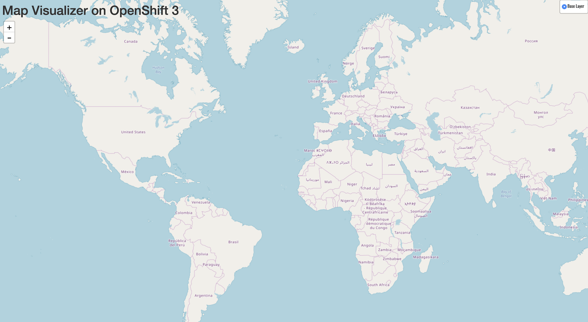

 _服务_ 在OpenShift中提供内部抽象和负载平衡
环境，但有时在OpenShift **外面** 的客户端(用户、系统、设备等)需要访问应用程序。外部客户的能力
要访问运行在OpenShift中的应用程序，需要通过OpenShift路由层。
控制这个的资源对象是一个路由。

默认的OpenShift路由器(HAProxy)使用传入的HTTP报头
请求确定代理连接的位置。您可以选择定义
安全，如TLS，为 _路线_ 。如果你需要你的 _服务_ ，和，通过
扩展，你的 _豆荚_ ，要能被外部世界访问，你需要
创建一个 _路线_ 。

正如我们在本教程前面提到的，部署应用程序的容器图像方法将默认为您创建一个路由。由于我们没有选中该选项，现在我们将手动创建一个路由。

## 练习: 创建一个路由

幸运的是，创建路由是一个非常简单的过程。首先，在 _开发人员_ 下拉菜单中切换到 _管理员_ 视角。确保您的 ``myproject`` 项目从项目列表中被选中。接下来，单击 *网络*，然后在左侧导航菜单中单击 *路由*。

点击蓝色的创建路由按钮。

输入 ``parksmap-katacoda`` 作为路由名，选择 ``parksmap-katacoda`` 作为 _服务_ ，选择 ``8080`` 作为目标端口。保持所有其他设置不变。

一旦您单击Create，该路由将被 _创建_ 并显示在路由详细信息页面中。

您还可以在开发人员视角中查看您的路由。切换回开发人员视角，然后转到 _拓扑_ 视图。在 ``parksmap-katacoda`` 可视化中，你现在应该会在圆的右上角看到一个图标。这表示路由，如果您单击它，它将在您的浏览器中打开URL。

一旦你点击了 _路线_ 图标，你应该会在浏览器中看到这个:

