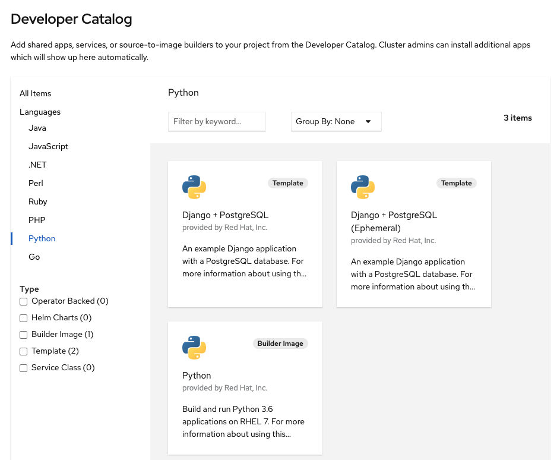

在本节中，您将为ParksMap应用程序部署后端服务。这个后端服务将通过REST服务API提供关于世界各地主要国家公园的数据。ParksMap前端web应用程序将查询该数据，并将其显示在web浏览器中的交互式地图上。

# 背景: Source-to-Image (S2I)

在前一节中，您了解了如何从预先存在的容器镜像部署应用程序(ParksMap前端)。在这里，您将学习如何直接从远程Git存储库中的源代码部署应用程序。这可以使用Source-to-Image (S2I)工具完成。

S2I的文档是这样描述自己的:

> Source-to-image (S2I)是一种用于构建可复制容器镜像的工具。S2I通过将源代码注入到容器映像中，并组装一个包含构建器镜像和已构建源代码的新容器映像来生成准备运行的映像。结果就可以在docker运行时使用了。S2I支持增量构建，可以重用以前下载的依赖项、以前构建的构件等。

OpenShift支持S2I，可以使用S2I作为其构建机制之一(除了从Dockerfiles和"自定义"构建构建容器镜像之外)。

对S2I的全面讨论超出了本教程的范围。关于S2I的更多信息可以在 [OpenShift S2I文档](https://docs.openshift.com/container-platform/latest/builds/understanding-image-builds.html#build-strategy-s2i_understanding-image-builds) 和GitHub S2I项目库中找到。

关于S2I，您需要记住的唯一关键概念是，它处理从源代码构建应用程序容器镜像的过程。

# 练习: 部署应用程序代码

您将在本节中部署的后端服务称为 ``nationalparks-katacoda`` 。这是一个Python应用程序，它将通过REST服务API以JSON的形式返回世界各地主要国家公园的地图坐标。该应用程序的源代码库可以在GitHub上找到:

* [https://github.com/openshift-roadshow/nationalparks-katacoda](https://github.com/openshift-roadshow/nationalparks-katacoda)

要部署应用程序，您将使用开发人员视角左侧导航菜单中的 **+ADD** 选项，因此要确保打开OpenShift web控制台，并且您处于名为 ``myproject`` 的项目中。单击 **+ADD** 。这一次，不是使用 *容器镜像* ，而是选择 _From Catalog_ ，它将带您到以下页面:

如果您没有看到任何项目，那么取消选中 **Operator Backed** 复选框。在 **语言** 部分，在支持的语言列表中选择Python。当出现 *Django + Postgres SQL*、*Django + Postgres SQL (Ephemeral)* 和 *Python* 选项时，选择 *Python* 选项，然后单击 _创建应用程序_ 。

 _Git存储库URL_ :

``https://github.com/openshift-roadshow/nationalparks-katacoda``{{copy}}

输入之后，在文本输入字段之外单击，然后应该会看到应用程序的名称显示为 ``nationalparks-katacoda`` 。名称需要为 ``nationalparks-katacoda`` ，因为ParksMap应用程序的前端希望后端服务使用该名称。

让所有其他选项保持原样。

单击屏幕右下角的 _创建_ ，您将返回到拓扑视图。单击 ``nationalparks-katacoda`` 应用程序的圆圈，然后单击侧面板中的 _资源_ 选项卡。在 _构建_ 部分中，您应该看到构建正在运行。

在这个步骤中，从Git存储库在应用程序源代码上运行S2I，以创建将要运行的镜像。单击构建的 _查看日志_ 链接，您可以按照下面的步骤进行操作，Python的S2I构建器下载运行应用程序所需的所有Python包，准备应用程序并创建镜像。

构建完成后回到 _拓扑视图_ ，查看正在部署的镜像和正在启动的应用程序。当您在构建日志中看到以下内容时，构建就完成了: ``Push successful`` 。

 ``nationalparks-katacoda`` 组件可视化左下角的绿色复选标记表明构建已经完成。当振铃由浅蓝色变为蓝色时，部署后端 ``nationalparks-katacoda`` 业务。

现在，回到浏览器中的ParksMap前端应用程序，您现在应该能够看到显示的国家公园的位置。如果您的浏览器中还没有打开该应用程序，请转到“拓扑视图”，并单击 ``parksmap-katacoda`` 应用程序圆圈右上角的图标，以在浏览器中打开URL。

恭喜你!您刚刚学习了如何开始使用OpenShift容器平台的基本知识。

现在您已经完成了本教程，请单击 _继续_ 以获得更多资源和工具，以帮助您了解有关OpenShift的更多信息。