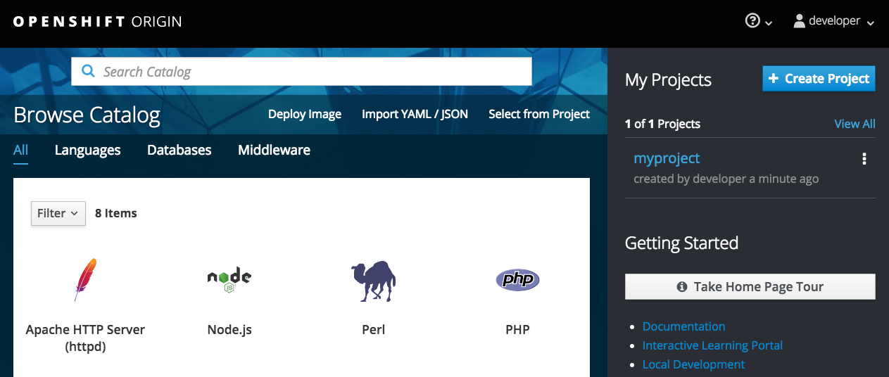

在我们开始之前，您需要登录并在OpenShift中创建一个项目
在工作。

要从 _终端_ 登录到本课程使用的OpenShift群集，
运行:

``oc login -u developer -p developer``{{execute}}

这将使用凭证登录您:

* **用户名:** ``developer``
* **密码:** ``developer``

您应该会看到输出:

```
Login successful.

You don't have any projects. You can try to create a new project, by running

    oc new-project <projectname>
```

要创建一个名为 ``myproject`` 的新项目，运行以下命令:

``oc new-project myproject``{{execute}}

你应该看到类似的输出:

```
Now using project "myproject" on server "https://172.17.0.41:8443".

You can add applications to this project with the 'new-app' command. For example, try:

    oc new-app centos/ruby-22-centos7~https://github.com/openshift/ruby-ex.git

to build a new example application in Ruby.
```

切换到仪表板并使用。登录到OpenShift web控制台
与上面使用的凭据相同。


这将使您停留在服务目录。您还应该看到右侧列出了您创建的项目 ``myproject`` 。

