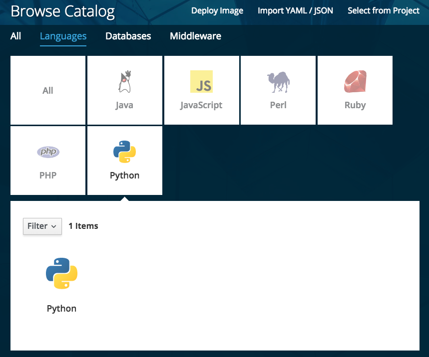
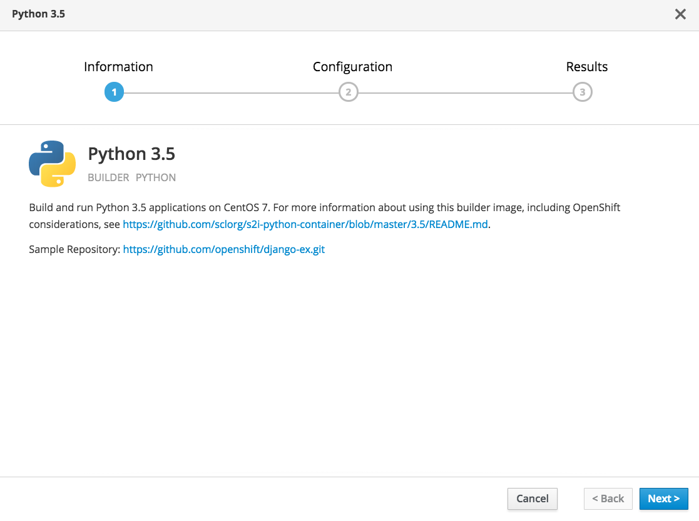
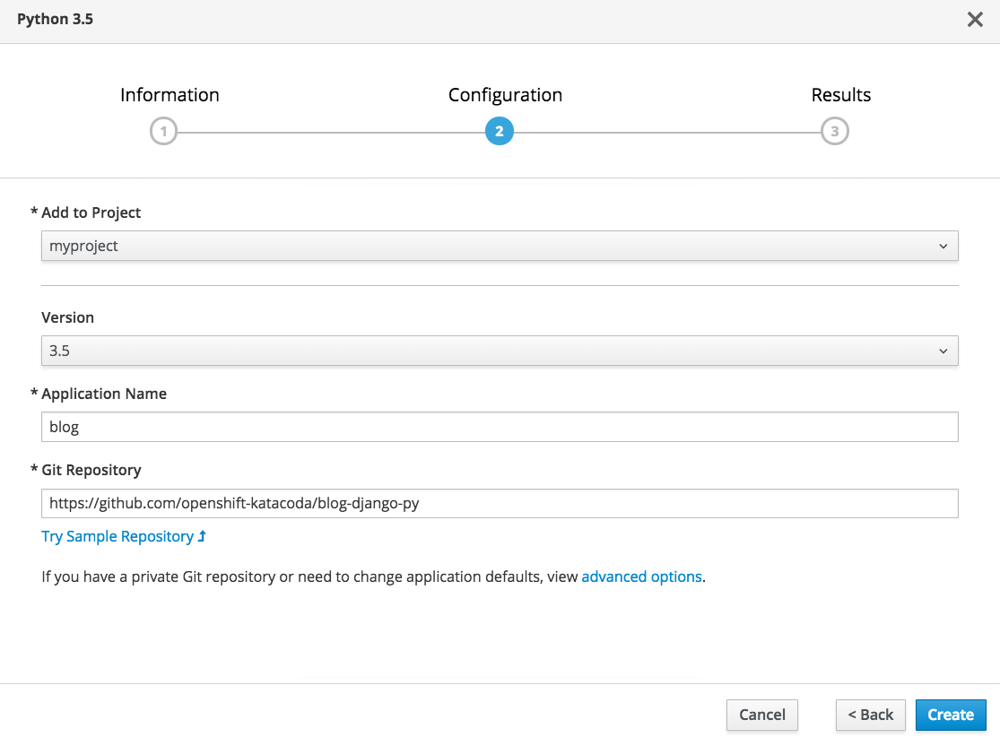
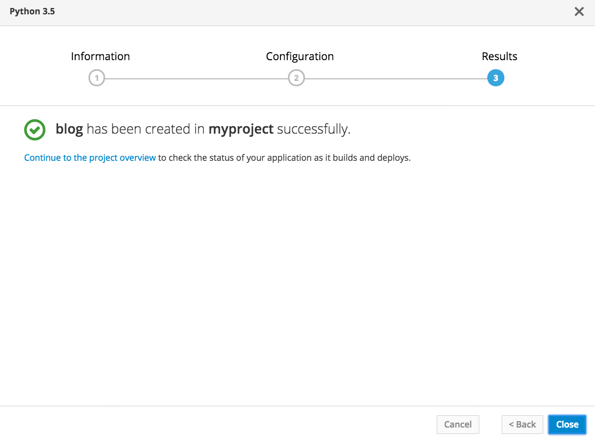
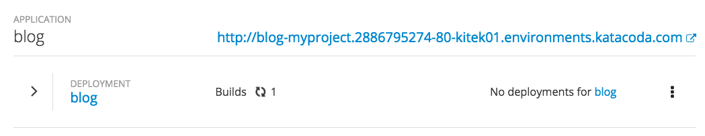

在本课程中，你将首先部署一个web应用程序，它是使用Python编程语言实现的。

从服务目录中选择 _语言_ 类别，然后选择 _Python_ 。

任何与Python相关的应用程序部署选项都将显示出来。在本课程使用的环境中，给出的唯一选项将是Python源代码到镜像(S2I)构建器。单击下方窗格中的 _Python_ ，开始为应用程序设置部署。

显示的第一个闪屏将提供有关正在使用的S2I构建器的信息。

单击 _下一个_ 以进入部署的配置。

对于 _应用程序名称_ ，输入:

``blog``{{copy}}

对于Git仓库，输入:

``https://github.com/openshift-katacoda/blog-django-py``{{copy}}

准备好之后，在页面底部单击 _创建_ 。这将带您进入最终的启动页面，确认应用程序已经创建。

单击Continue以查看项目概述。这将把您带到项目的 _概述_ 页面，在这里您可以查看创建的应用程序的详细信息，并在构建和部署应用程序时监视进度。

