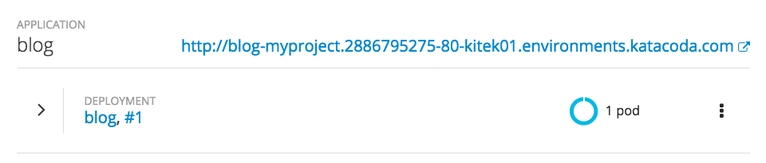
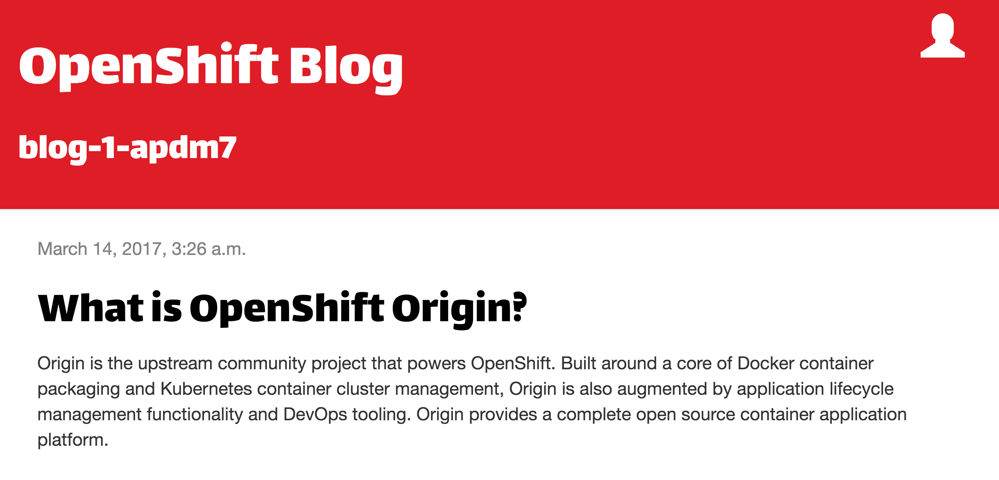

一旦完成了应用程序镜像的构建，就将部署它。

当您使用web控制台从应用程序源代码部署应用程序时，将自动为该应用程序创建一个路由，并且它将暴露在集群之外。可用于从web浏览器访问应用程序的URL将显示在 _概述_ 页面上。

单击URL，您可以查看web应用程序。

此时，示例Python web应用程序已经使用本地SQLite数据库部署，并在启动时将数据预加载到数据库中，以便进行测试。

但是使用的SQLite数据库存储在容器文件系统中，这意味着每次重新部署web应用程序时都将丢弃它。这将导致通过web应用程序输入的任何内容都将丢失，并且web应用程序将恢复到显示作为测试数据预先加载的内容。

对于生产站点，应该使用使用持久卷的单独数据库，并配置web应用程序来使用它。