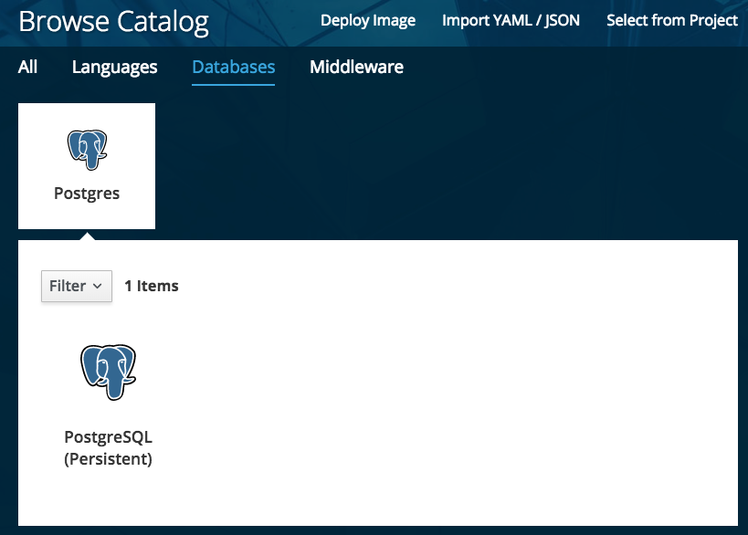
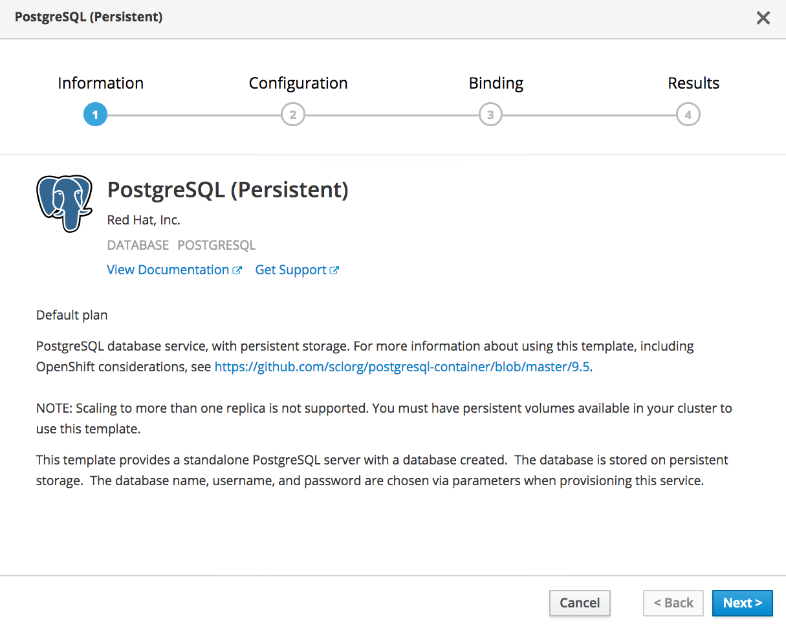
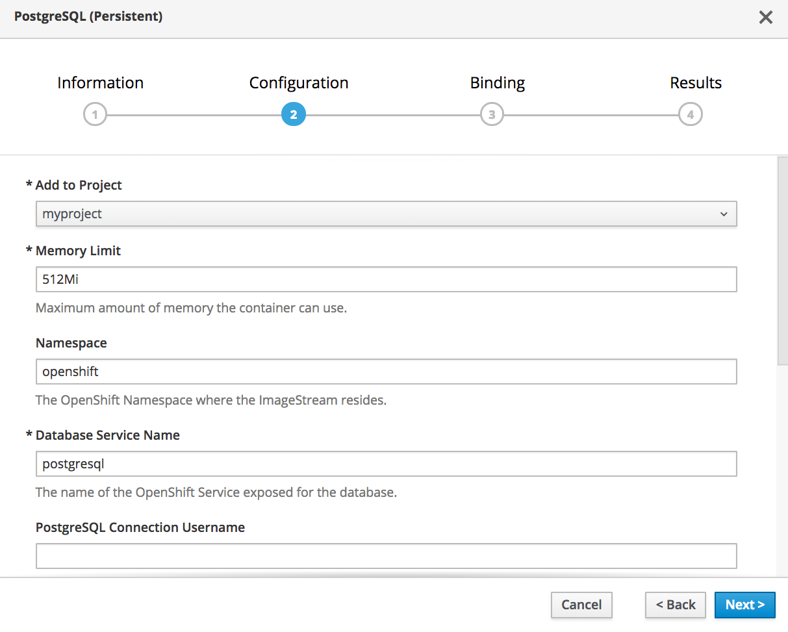
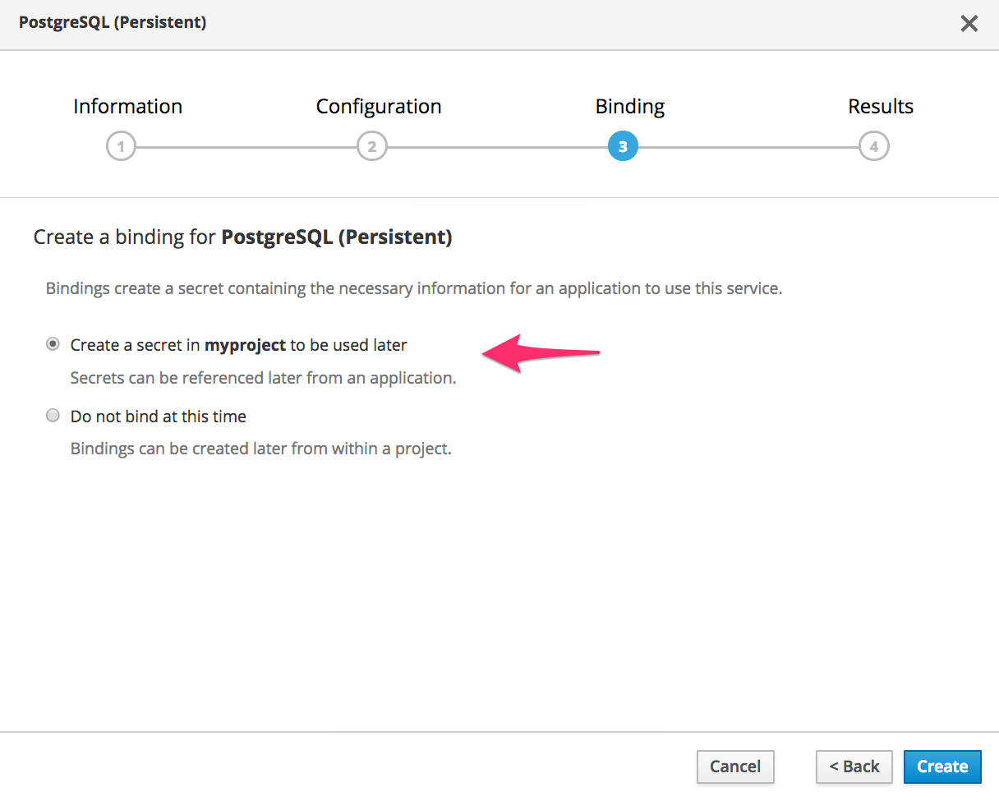
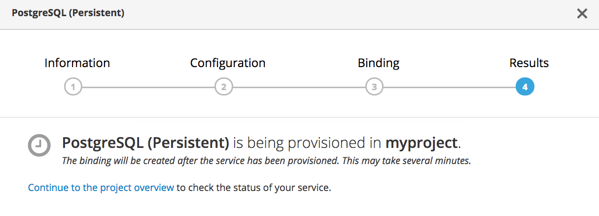

要部署web应用程序可以使用的PostgreSQL _数据库_ ，单击顶部菜单栏中的Add To Project，选择 _浏览目录_ ，然后选择Databases类别。

在本课程使用的环境中，唯一的选择应该是PostgreSQL数据库。单击下方窗格中的PostgreSQL (Persistent)，开始为数据库设置部署。

显示的第一个闪屏将提供关于可以部署的PostgreSQL数据库的信息。

单击 _下一个_ 以进入部署的配置。

对于本教程，您可以保留所有默认值。单击 _下一个_ 设置服务绑定。

确保选择了创建秘密的选项。这个秘密将保存web应用程序使用的数据库凭据。

单击 _创建_ 启动数据库的部署。

单击Continue到项目概述查看数据库的部署情况。