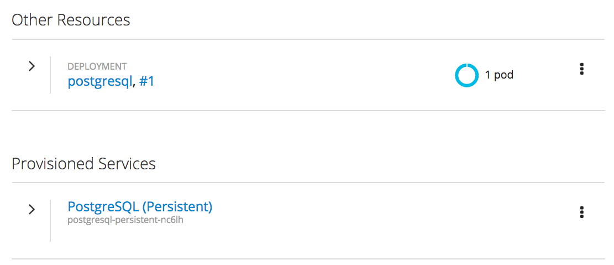
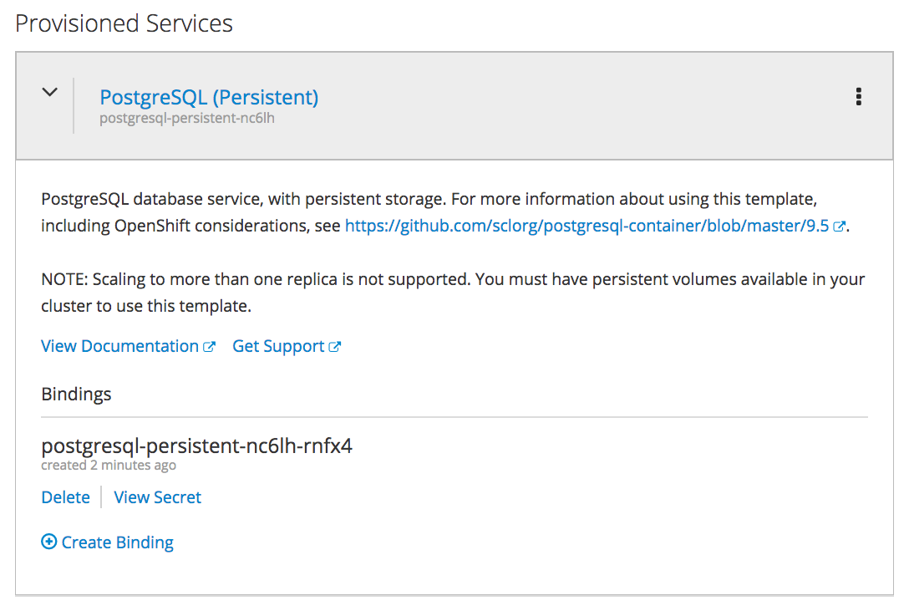
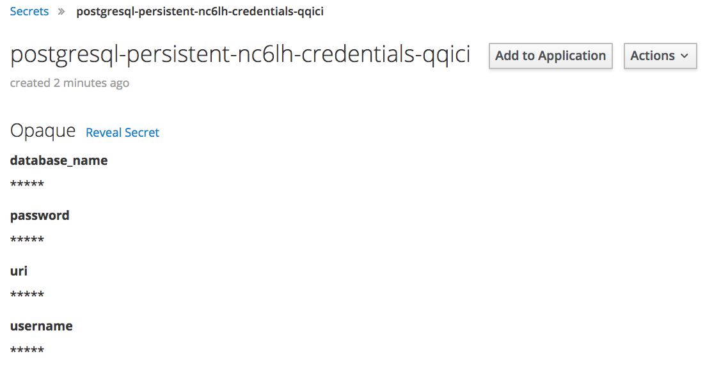
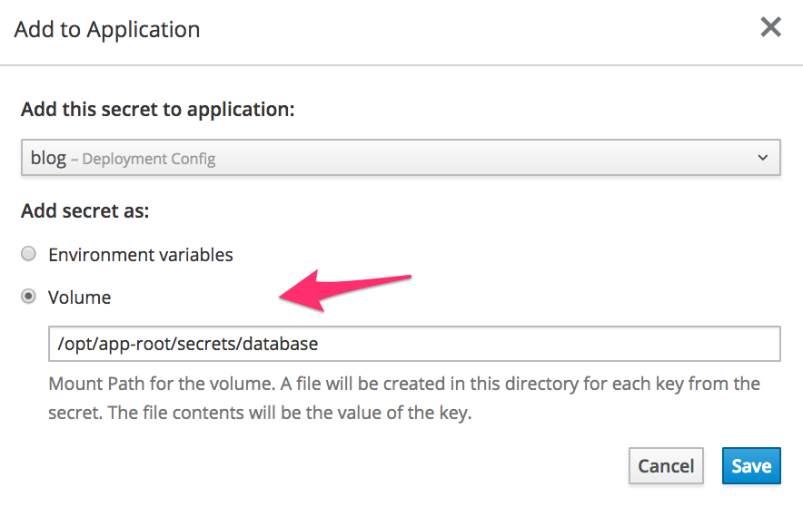

一旦供应了数据库，您应该在项目的 _概述_ 页面上看到两个与数据库相关的条目。第一个是实际部署，第二个是供应服务下列出的服务绑定。

单击 _提供服务_ 下条目左边向右的箭头，以显示服务的详细信息。

在Bindings下，您可以看到创建的服务 _绑定_ ，以及包含数据库凭据的 _秘密_ 。

点击查看秘密。

创建的秘密包含数据库的名称、用户详细信息和数据库的连接详细信息。

要让web应用程序使用这些详细信息，单击Add To application。

从“添加这个秘密到应用程序”下拉菜单中选择 ``blog`` 。

关于如何将数据库凭据注入到应用程序中，有两个选项。

第一种是作为环境变量，第二种是将秘密作为一个卷挂载到容器中。

本教程中使用的web应用程序通过安装卷接受秘密。选择 _体积_ 并输入:

``/opt/app-root/secrets/database``{{copy}}

作为mount路径。

单击 _保存_ 。