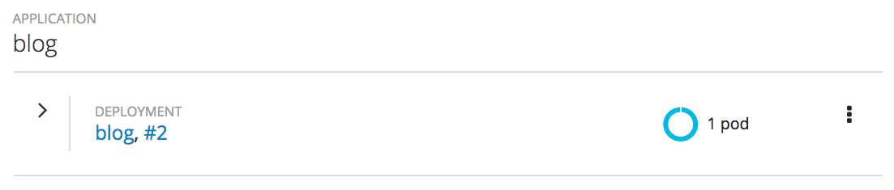
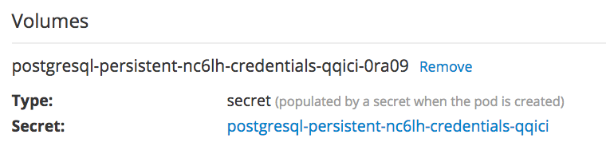
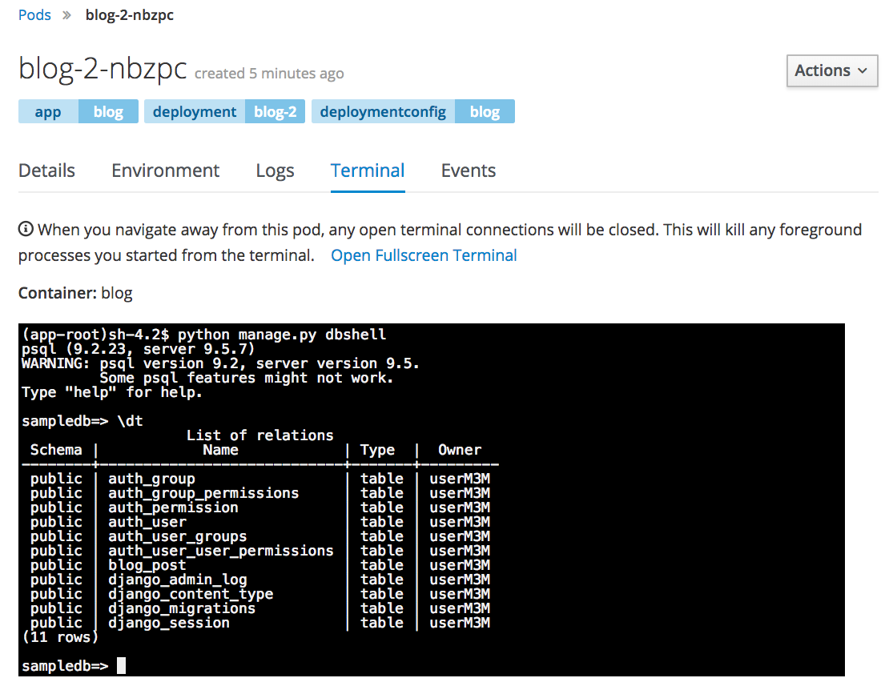

在将 _秘密_ 添加到应用程序时，由于这是一个配置更改，应用程序将自动重新部署。您应该会看到部署号增加了。

点击中间的蓝色圆圈显示豆荚的状态。这应该会让你了解豆荚的 _细节_ 。向下滚动，您应该会看到 _秘密_ 作为一个卷挂载在容器中。

要验证web应用程序现在正在使用PostgreSQL，请单击 _圆荚体_ 的 _终端_ 选项卡。

在 _终端_ 中，运行:

``python manage.py dbshell``{{copy}}

您将看到，这导致PostgreSQL数据库客户端正在运行。输入:

``\dt``{{copy}}

在提示时列出已在数据库中创建的表。