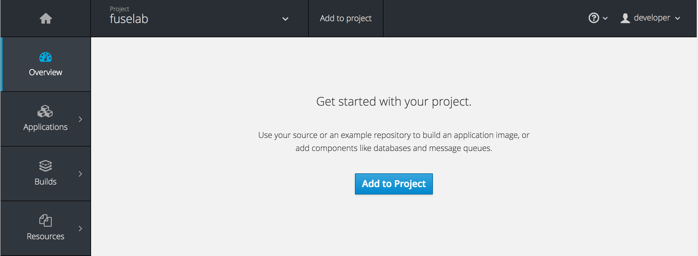

Lets get started adding an application to the **fuselab** project



Its now time to build and deploy the People Service API onto OpenShift. To do this we will be using OpenShift's Source 2 Image capabilities, also referred to as **_S2I_** . The OpenShift S2I tool injects application source code into a container image and the final product is a new and ready-to-run container image that incorporates the builder image and built source code. You can find more details regarding S2I at the finish of this scenario. 

To get started with S2I, we will use a pre-defined template for our People Service API which contains the details for the APIs build, deployment, and services configurations. The template also references the source repositories which contain the Fuse API application. For reference the template is located [here](https://raw.githubusercontent.com/jbossdemocentral/katacoda-fuse-getting-started/master/src/main/openshift/fgstemplate.yml "People Service Template").

Lets head on back over to the terminal, by clicking on the terminal tab at the top. The first step in building and deploying the People Service API is to create a new application based on the provided template by executing the following command:

`oc new-app -f https://raw.githubusercontent.com/jbossdemocentral/katacoda-fuse-getting-started/master/src/main/openshift/fgstemplate.yml`{{execute}}

If successful, you will be prompted with the following output: 

```
 --> Deploying template "fuselab/mypeopleservice-template" for "fgstemplate.yml" to project fuselab

     mypeopleservice-template
     ---------
     Katacoda || FUSE || Getting started


     * With parameters:
        * Application Name=mypeopleservice
        * Git Repository URL=https://github.com/jbossdemocentral/katacoda-fuse-getting-started.git
        * CONTEXT_DIR=
        * Git Reference=master
        * Builder version=2.0
        * Application Version=1.0.0
        * Maven Arguments=package -DskipTests -Dfabric8.skip -e -B
        * Extra Maven Arguments=
        * Maven build directory=
        * Image Stream Namespace=openshift
        * Git Build Secret=mu0wpUmOlnJrlTAiSejX4b5KdYSC0kWPFQBfxEVy # generated

--> Creating resources ...
    route "mypeopleservice" created
    service "mypeopleservice" created
    imagestream "mypeopleservice" created
    buildconfig "mypeopleservice" created
    deploymentconfig "mypeopleservice" created
--> Success
    Use 'oc start-build mypeopleservice' to start a build.
    Run 'oc status' to view your app.
```

The ``oc new-app`` command creates a new application in OpenShift either by using a local or remote project. In this case we have used a project hosted remotely at GitHub, the location of which can be found at the bottom of the referenced [template](https://github.com/jbossdemocentral/katacoda-fuse-getting-started/blob/94f3c2b940aaa50301c0b8d8d66d07de642947ca/src/main/openshift/fgstemplate.yml#L194).

Now that the applications template is configured in our project we can start the build and deployment part of this scenario.

We start a build with the ``oc start-build`` command. This command tells OpenShift to start a build process which then clones the project from the provided GitHub repository, compiles it, and then ultimately packaging the code deployment as a container on OpenShift. In this case the JBoss FIS 2.0 People Service API project, hosted [here](https://github.com/jbossdemocentral/katacoda-fuse-getting-started) at GitHub, is a standard Maven project with a pom.xml and associated sources. The OpenShift's S2I builder knows how to handle a Maven project and will execute accordingly when the projects pom file is discovered. So lets kick start and build application and see what happens by running : 

`oc start-build mypeopleservice`{{execute}}

Which is followed by ``build "mypeopleservice-1" started`` if the the command is completed successfully. 

How do we know if the build is actually working or not. Well there are a couple of ways we can monitor the build of our application. Click **_Continue_** on to see how.


