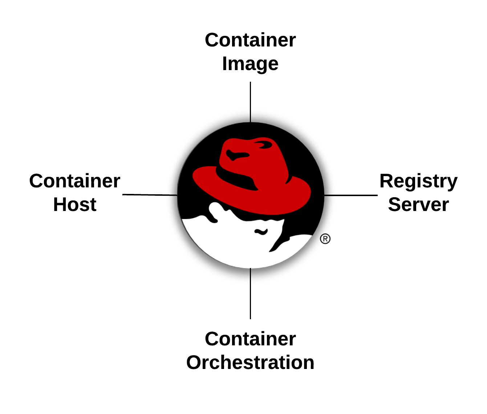

如果您了解Linux，那么您可能已经掌握了理解容器所需的85%的知识。如果您了解进程、挂载、网络、shell和守护进程是如何工作的——像ps、mount、ip addr、bash、httpd和mysqld这样的命令——那么您只需要了解一些额外的原语，就可以成为容器专家。记住，所有你今天已经知道的东西仍然适用:从安全性和性能到存储和网络，容器只是打包和交付Linux应用程序的一种不同方式。有四个基本的基本原理需要学习，以使您从Linux管理员适应容器:

* [容器的图片](https://developers.redhat.com/blog/2018/02/22/container-terminology-practical-introduction/#h.dqlu6589ootw)
* [容器注册](https://developers.redhat.com/blog/2018/02/22/container-terminology-practical-introduction/#h.4cxnedx7tmvq)
* [容器的主机](https://developers.redhat.com/blog/2018/02/22/container-terminology-practical-introduction/#h.8tyd9p17othl)
* [集装箱编配](https://developers.redhat.com/blog/2018/02/22/container-terminology-practical-introduction/#h.6yt1ex5wfo66)

一旦你理解了基本的四个原语，在以后的实验中会涉及到一些高级的概念，包括:

* 容器标准:了解OCI, CRI, CNI等等
* 容器工具生态系统- Podman, Buildah, Skopeo，云注册等
* 生产图构建:技术专家之间的共享和协作(性能、网络、安全、数据库等)
* 中间架构:生产环境
* 先进的架构:在弹性
* 容器的历史:我们今天所处的环境

涵盖所有这些材料超出了任何现场培训的范围，但我们将涵盖基本内容，学生可以继续学习课堂上没有涉及的其他实验室。这些实验室可以在 <http://learn.openshift.com/subsystems> 网站上找到。

现在，让我们从介绍实验开始，它涵盖了这四个基本原理:

