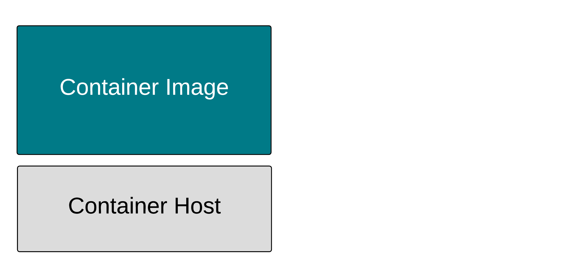
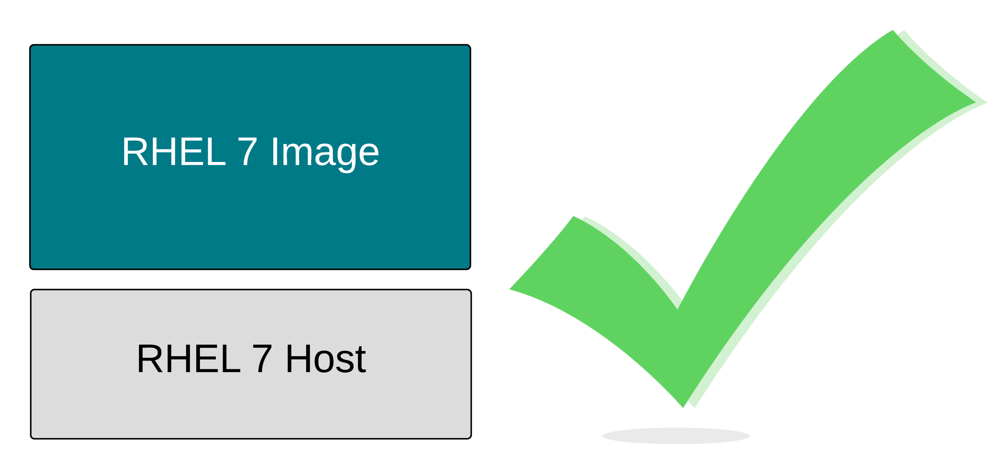
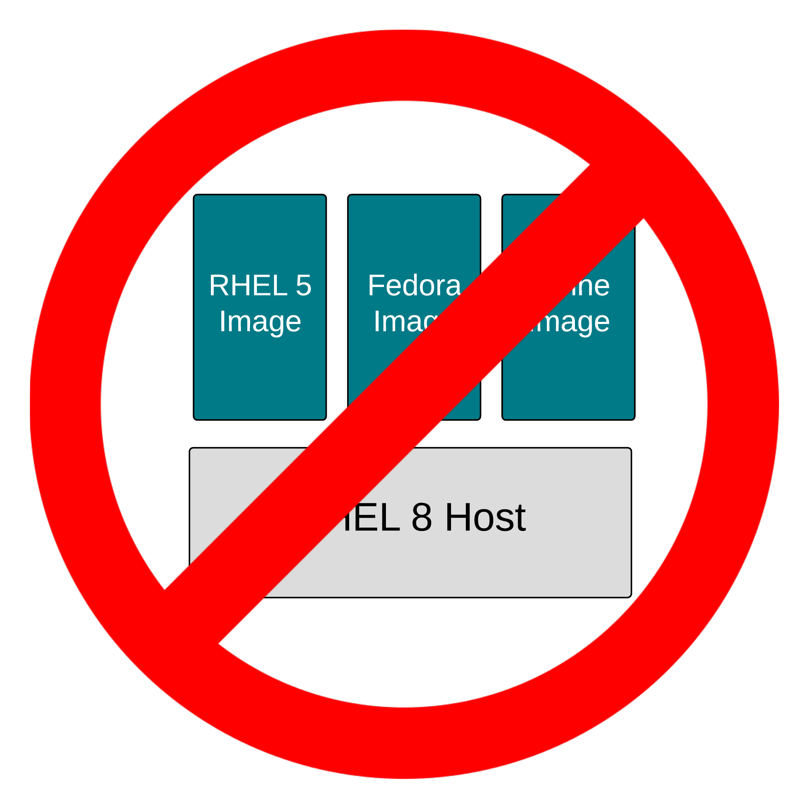
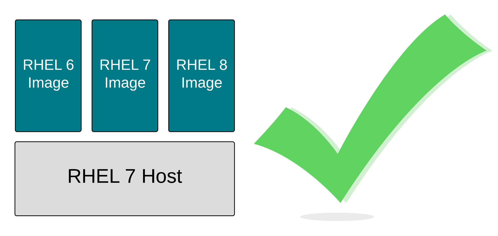

容器图像实际上只是tar文件。说真的，它们是tar文件，带有一个相关的JSON文件。我们把这些叫做图像包。这个包的磁盘格式是由OCI镜像规范定义的。所有主要的容器引擎，包括Podman、Docker、RKT、crio和containerd都会构建并使用这些包。

但让我们更深入地探讨三个概念:

1. 可移植性:由于OCI标准管理图像规范，容器镜像可以用Podman创建，推入几乎所有的容器注册表，与世界共享，并被几乎所有的容器引擎使用，包括Docker、RKT、crio、containerd，当然还有其他的Podman实例。通过对这种图像格式进行标准化，我们可以构建像注册表服务器这样的基础设施，这些服务器可以用来存储任何容器镜像，无论是RHEL 6、RHEL 7、RHEL8、Fedora，甚至是Windows容器映像。无论容器镜像中是哪个操作系统或二进制文件，映像格式都是相同的。注意，Podman可以下载一个Fedora镜像，解压缩它，并将其存储在本地/var/lib/containers映像存储中，即使这不是一个Fedora容器主机:

``podman pull fedora``{{execute}}

1. 兼容性:这解决了容器图像中的内容。无论如何努力，容器镜像中的ARM二进制文件都不会在POWER容器主机上运行。容器不提供兼容性保证;只有虚拟化可以做到这一点。这个兼容性问题扩展到处理器体系结构，以及操作系统的版本。尝试在RHEL 4容器主机上运行RHEL 8容器镜像——这行不通。然而，只要操作系统相当相似，容器镜像中的二进制文件通常就会运行。注意，使用Fedora镜像执行基本命令可以工作，即使这不是一个Fedora容器主机:

``podman run -t fedora cat /etc/redhat-release``{{execute}}

1. 可支持:这是供应商可以支持的。这涉及到在测试、安全性、性能和体系结构方面的投资，以及确保构建镜像和二进制文件的方式能够在给定的一组容器主机上正确运行。例如，Red Hat在RHEL 7和RHEL 8容器主机上都支持RHEL 6、UBI 7和UBI 8容器镜像(CoreOS是由RHEL bits构建的)。Red Hat不能保证这个星球上的容器形象和宿主组合的每一种排列都能成功。它将以非线性的速度扩展测试和分析矩阵资源。为了进行演示，请在这个容器主机上运行一个Red Hat Universal Base Image (UBI)容器。如果这是一个RHEL容器主机，这将是完全支持的(抱歉，只有CentOS主机可用的这个实验室环境:-)所以不支持，但你得到的重点):

``podman run -t registry.access.redhat.com/ubi7/ubi cat /etc/redhat-release``{{execute}}

通过分析可移植性、兼容性和可支持性，我们可以推断RHEL 7镜像将在RHEL 7主机上完美地工作。两者的代码都是一起设计、编译和测试的。Red Hat的产品安全团队正在分析cve，性能团队正在测试RHEL 7 web服务器和RHEL 7内核，等等。整个软件创建和测试机器都在这种配置下工作，同时编译、构建和测试程序和内核。容器镜像和主机的匹配版本继承了所有这些工作:

然而，也有一些限制。Red Hat不能保证RHEL 5、Fedora和Alpine图像在RHEL 7主机上能够像预期的那样工作。容器图像标准保证了容器引擎能够接收图像，将它们下拉并在本地缓存它们。但是，没有人能保证容器镜像中的二进制文件将正确工作。没有人能保证不会因为版本组合而出现奇怪的cve(是的，这“很正常”)，当然，没有人能保证运行在没有编译过的内核上的二进制文件的性能。也就是说，很多时候，这些双星似乎都能正常工作。

这使我们将支持性作为一个概念，与可移植性和兼容性分离。这是在一定程度上保证某些镜像将在某些主机上工作的能力。Red Hat可以在选定的RHEL主要版本之间这样做，原因与我们可以在 [RHEL应用程序兼容性指南](https://access.redhat.com/articles/rhel-abi-compatibility) 中这样做的原因相同。我们采取特别的预防措施，以不破坏兼容性的方式编译我们的程序，我们分析cve，并测试性能。最低限度的测试、安全性和性能对于确保Linux版本之间的可支持性有很大帮助，但是有一些限制。我们不应该期望来自RHEL 9、10或11的容器镜像会在RHEL 8主机上运行。

好了，现在我们已经整理出了容器镜像的基本知识，让我们进入注册表…