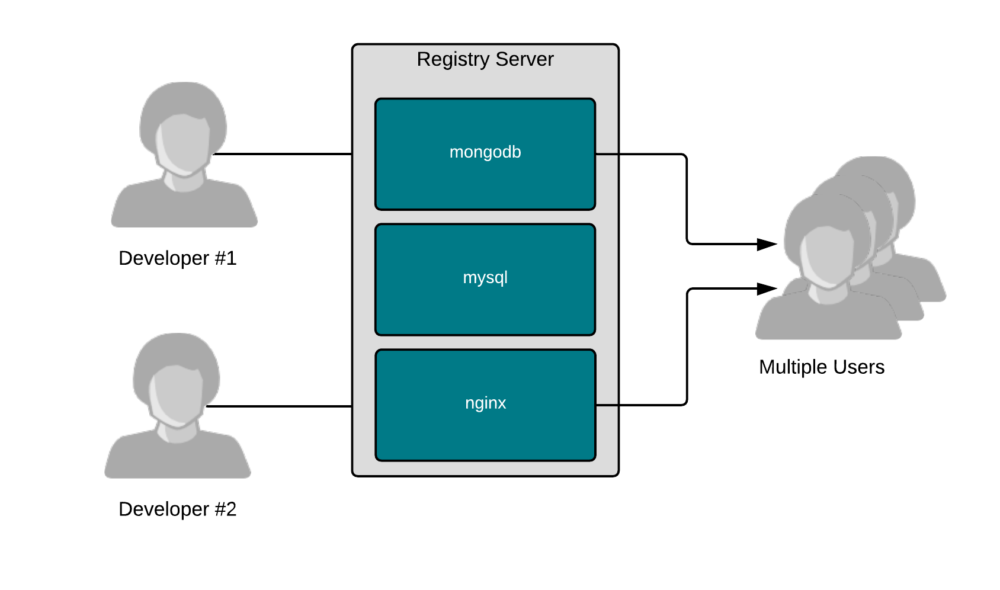

注册中心实际上只是帮助用户彼此共享容器镜像的花哨文件服务器。容器的神奇之处在于能够通过一种新的打包格式来查找、运行、构建、共享和协作，这种打包格式将应用程序及其所有依赖项组合在一起。



容器镜像使软件构建者能够很容易地打包软件，并提供关于如何运行它的信息。通过使用元数据，软件构建者 _可以_ 传达用户可以以及 _应该_ 如何运行他们的软件，同时提供了基于现有软件构建新东西的灵活性。

注册表服务器使与其他用户共享这项工作变得容易。构建者可以将镜像推送到注册表中，允许用户甚至像CI/CD系统这样的自动化系统将其下拉并使用数千次或数百万次。有些注册中心(如 [红帽集装箱目录](https://access.redhat.com/containers/) )提供的图像是经过高度策划、经过良好测试的企业级图像。其他人,像码头。io是基于云计算的注册中心，为个人用户提供公共和私人空间来推送他们自己的图片并与他人分享。策划注册中心对于希望一起交付解决方案的合作伙伴(例如。Red Hat和CrunchyDB)，而基于云的注册表对终端用户协作工作很有帮助。

作为一个例子，展示了与quay共享的力量。让我们拉出一个为这个实验室设计和构建的容器图像:

``podman pull quay.io/fatherlinux/linux-container-internals-2-0-introduction``{{execute}}

现在，运行这个模拟数据库:

``podman run -d -p 3306:3306 quay.io/fatherlinux/linux-container-internals-2-0-introduction``{{execute}}

现在，用我们非常简单的客户机curl轮询模拟的数据库:

``curl localhost:3306``{{execute}}

请注意这些命令是多么容易。我们不需要非常了解如何运行它。关于如何运行它的所有复杂逻辑都嵌入到图像中。下面是构建文件，以便您可以检查开始逻辑(ENTRYPOINT)。你可能不完全理解bash代码，但是没关系，这就是为什么容器是有用的:

```
#
# Version 1

# Pull from Red Hat Universal Base Image
FROM registry.access.redhat.com/ubi7/ubi-minimal

MAINTAINER Scott McCarty smccarty@redhat.com

# Update the image
RUN microdnf -y install nmap-ncat && \
    echo "Hi! I'm a database. Get in ma bellie!!!" > /srv/hello.txt

# Output
ENTRYPOINT bash -c 'while true; do /usr/bin/nc -l -p 3306 < /srv/hello.txt; done'
```

意识到使用注册表服务器构建和共享是多么容易，这是本实验室的目标。您可以使用构建文件将运行时逻辑嵌入到容器镜像中，从而不仅传达要运行 _什么_ ，而且还传达 _如何_ 运行。您可以共享容器镜像，让其他人更容易使用它。您还可以使用诸如GitHub之类的工具来共享构建文件，以方便其他人在您的工作基础上进行构建(为win开源)。

现在，让我们来看看容器主机…