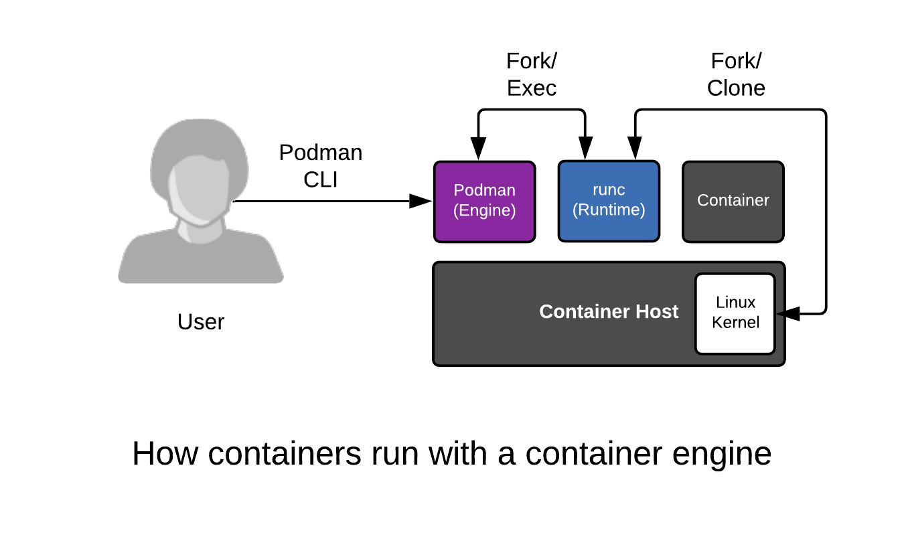

要理解容器宿主，我们必须分析共同创建容器的层。它们包括:

* [容器引擎](https://developers.redhat.com/blog/2018/02/22/container-terminology-practical-introduction/#h.6yt1ex5wfo3l)
* [容器运行时](https://developers.redhat.com/blog/2018/02/22/container-terminology-practical-introduction/#h.6yt1ex5wfo55)
* [Linux内核](https://lwn.net/Articles/780364/)

## 容器引擎

容器引擎可以松散地描述为任何为构建或运行容器提供API或CLI的工具。这始于Docker，但也包括Podman, Buildah, rkt和crio。容器引擎接受用户输入，提取容器图像，创建描述如何运行容器的元数据，然后将这些信息传递给容器运行时。

## 容器运行时

容器运行时是一个小工具，它需要完成两件事情——一个通常称为根文件系统(rootfs)的目录，以及一些称为config的元数据。json(或spec文件)。最常见的运行时 [runc](https://github.com/opencontainers/runc) 是上面提到的每个容器引擎的默认运行时runc。然而，有许多创新的运行时，包括katacontainers、gvisor、crun和railcar。

## Linux内核

内核负责容器创建的最后一英里，以及在其运行生命周期期间的资源管理。容器运行时与内核通信，使用名为clone()的特殊内核函数创建新的容器。运行时还处理与内核的对话，以配置诸如cgroups、SELinux和SECCOMP(稍后详细介绍)等内容。调用的内核技术组合是由容器运行时定义的，但是最近有一些努力在内核中标准化这些技术。

容器只是作为容器运行时的子进程启动的常规Linux进程，而不是由在shell中运行命令的用户启动的。所有的Linux进程都是并排存在的，无论是守护进程、批处理作业还是用户命令——容器引擎、容器运行时和容器(容器运行时的子进程)也没有什么不同。所有这些进程都向Linux内核请求受保护的资源，如内存、RAM、TCP套接字等。

使用podman执行一些命令，并注意进程id和名称空间id。容器只是常规过程:

``podman ps -ls``{{execute}}

``podman top -l huser user hpid pid %C etime tty time args``{{execute}}

``ps -ef | grep 3306``{{execute}}

我们将在以后的实验室中更深入地探讨这个问题，但现在，把它提交给内存，容器只是Linux…