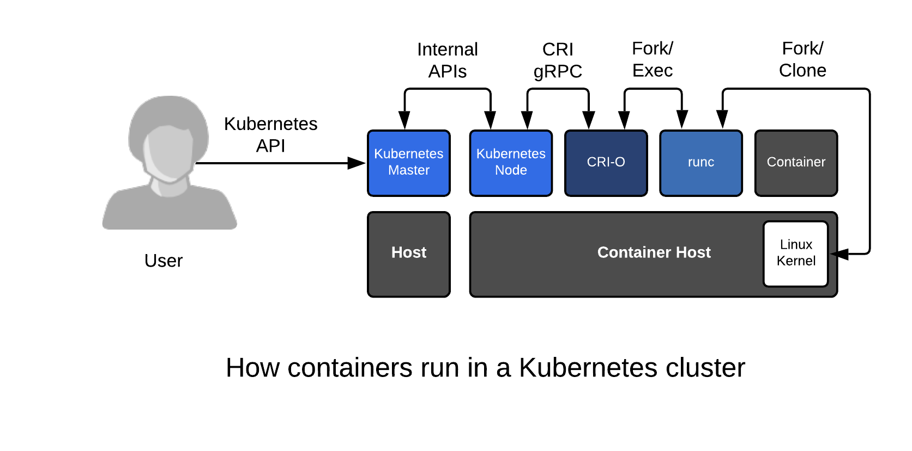

在您熟悉了在单个主机上使用容器之后，容器编排是下一个逻辑进程。使用单个容器主机，可以像管理传统应用程序一样管理容器化应用程序，同时获得增量效率。对于编排，有一个重大的范式转变——开发人员和管理员都需要以不同的方式思考，通过一个API对应用程序进行所有更改。有些人质疑它的“复杂性”。但它的好处远远超过学习它的工作。今天，Kubernetes在容器编排方面是明显的赢家，通过它，您获得了:

* 应用程序定义——YAML和JSON文件可以在开发人员之间传递，也可以在开发人员之间传递，以运行功能完整的多容器应用程序
* 简单的应用程序实例——在不同的命名空间中运行同一个应用程序的多个版本
* 多节点调度——Kubernetes内建的控制器可以管理10或10,000个容器主机，没有额外的复杂性
* 强大的API——开发人员、集群管理员和自动化人员都可以定义应用程序状态、租赁，使用OpenShift 4甚至可以定义集群节点状态
* 操作自动化-[Kubernetes运营商框架](https://coreos.com/operators/)可以认为是一个机器人系统管理员，与应用程序一起部署，为应用程序管理普通和复杂的任务(备份、恢复等)。
* 更高级别的框架——一旦你采用了Kubernetes编排，你就可以访问一个创新的工具生态系统，比如Istio、Knative和前面提到的Operator框架



为了进行演示，我们只需要bash、curl和netcat，它们允许我们通过TCP端口传输文本。如果您熟悉基本的bash脚本，那么这个小型实验将分解编排的价值和应用程序本身的价值。这个应用程序没有做太多的工作，但是它展示了在包含数据库和web前端的容器中运行的两层应用程序的强大功能。在这个实验室中，我们使用与以前相同的容器镜像，但这次我们将 _如何_ 运行逻辑嵌入到Kubernetes YAML中。以下是我们的应用程序所做的简单表示:

```
User -> Web App (port 80) -> Database (port 3306)
```

快速浏览一下这个YAML文件，但是如果您没有完全理解YAML，也不要太担心。Kubernetes上有很多很棒的教程，大多数人通过迭代和构建新的应用程序来学习它:

``curl https://raw.githubusercontent.com/fatherlinux/two-pizza-team/master/two-pizza-team-ubi.yaml``{{execute}}

在“数据库中,“我们正在打开一个文件，并使用netcat通过端口3306发送它。在“web应用程序”中，我们从端口3306获取数据，然后像普通应用程序一样通过端口80将其发送回来。我们的想法是通过一个简单的例子来展示它的强大，而不需要学习其他的技术。我们可以用一个 _oc_ 命令立即启动这个应用程序:

``oc create -f https://raw.githubusercontent.com/fatherlinux/two-pizza-team/master/two-pizza-team-ubi.yaml``{{execute}}

等奶酪披萨和辣香肠披萨豆荚开始:

``for i in {1..5}; do oc get pods;sleep 3; done``{{execute}}

等到所有的舱都处于“运行”状态。

当pods创建完成后，从我们新创建的“web应用程序”中提取一些数据。注意，我们得到的是驻留在数据库服务器上的文件的内容，而不是web服务器:

``curl $(kubectl get svc pepperoni-pizza -o yaml | grep ip | awk '{print $3}')``{{execute}}

注意:上面括号中的命令只是获取web服务器的IP地址。

现在，让我们直接从“数据库”中提取数据。它的文件和我们期望的一样，但这一次返回到3306端口:

``curl $(kubectl get svc cheese-pizza -o yaml | grep clusterIP | awk '{print $2}'):3306``{{execute}}

花点时间注意一下，在Kubernetes中，我们可以用49个命令(在不同的项目中)启动这个应用程序的50个副本。# 39;进行实质性的年代,简单。