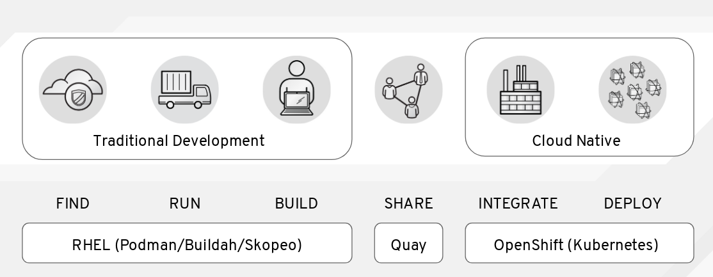

在本实验室中，我们介绍了容器镜像、注册表、主机和编配，作为您在容器之旅中需要学习的四个新原语。如果你正在努力理解为什么你需要容器，或者为什么需要转向编配——或者你正在努力向你的管理人员或团队中的其他人解释它——也许在这种情况下考虑它会有帮助:

这是一段旅程，我们总是乐于助人。如果你想在这个过程中得到帮助，可以在Twitter上关注以下一些人:

* Scott McCarty(产品经理):[@fatherlinux](https://twitter.com/fatherlinux)
* 丹·沃尔什(集装箱小组组长):[@rhatdan](https://twitter.com/rhatdan)
* Mrunal Patel (crio负责人):[@mrunalp](https://twitter.com/mrunalp)
* Nalin Dahyabhai (Lead for Buildah):[@atnalind](https://twitter.com/atnalind)
* 汤姆·斯威尼(核心工程师):[@TSweeneyRedHat](https://twitter.com/TSweeneyRedHat)
* Valentin Rothberg(核心工程师):[@vlntnrthbrg](https://twitter.com/vlntnrthbrg)
* 威廉·亨利(核心工程师):[@ipbabble](https://twitter.com/ipbabble)
* 文森特棉絮:(OCI贡献者):[@vbatts](https://twitter.com/vbatts)